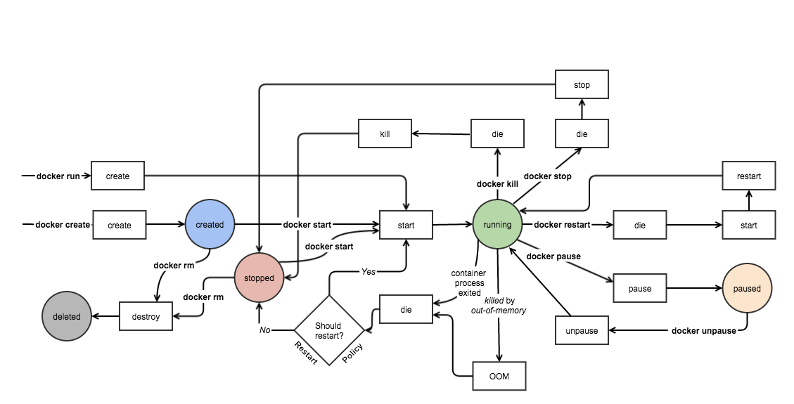
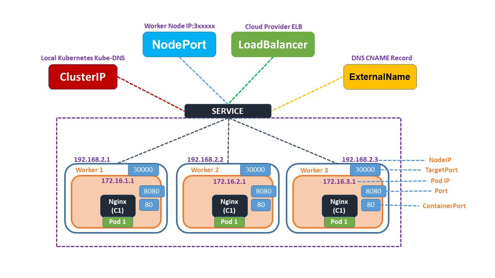

# Cloud Native 이해

## 컨테이너 기반 기술

* 격리 기술


### chroot (root directory)

```sh
root@docker1:~# chroot --version
chroot (GNU coreutils) 8.28
Copyright (C) 2017 Free Software Foundation, Inc.
License GPLv3+: GNU GPL version 3 or later <http://gnu.org/licenses/gpl.html>.
This is free software: you are free to change and redistribute it.
There is NO WARRANTY, to the extent permitted by law.

Written by Roland McGrath.

root@docker1:~# mkdir -p ~/newroot/{bin,lib,lib64}
root@docker1:~# tree
.
├── docker_lab.tgz
├── k8s_lab.tgz
└── newroot
    ├── bin
    ├── lib
    └── lib64
    
root@docker1:~# ldd /bin/bash
        linux-vdso.so.1 (0x00007ffea30f1000)
        libtinfo.so.5 => /lib/x86_64-linux-gnu/libtinfo.so.5 (0x00007f368ea54000)
        libdl.so.2 => /lib/x86_64-linux-gnu/libdl.so.2 (0x00007f368e850000)
        libc.so.6 => /lib/x86_64-linux-gnu/libc.so.6 (0x00007f368e45f000)
        /lib64/ld-linux-x86-64.so.2 (0x00007f368ef98000)

5 directories, 2 files
root@docker1:~# cp  /lib/x86_64-linux-gnu/libtinfo.so.5 ~/newroot/lib/x86_64-linux-gnu
root@docker1:~# cp  /lib/x86_64-linux-gnu/libdl.so.2  ~/newroot/lib/x86_64-linux-gnu
root@docker1:~# cp  /lib/x86_64-linux-gnu/libc.so.6  ~/newroot/lib/x86_64-linux-gnu
root@docker1:~# cp  /lib64/ld-linux-x86-64.so.2   ~/newroot/lib64    

root@docker1:~# chroot ~/newroot/ /bin/bash
bash-4.4# pwd
/

bash-4.4# echo  $$
13159

```

* 다른 창에서 열어 보면. bash 가 열려 있음을 알수 있음
* 완전히 분리된 것이 아니라 root / 만 분리한 것으로 되고 아직까지는 pid는 공유하고 있다. 

```
root@docker1:~# ps -ef | grep bash
root     13159  2115  0 05:23 pts/3    00:00:00 /bin/bash

```

* ls 명령도 라이브러리와 실행 파일 복사

```sh
root@docker1:~# ldd  /bin/ls
        linux-vdso.so.1 (0x00007ffcc2135000)
        libselinux.so.1 => /lib/x86_64-linux-gnu/libselinux.so.1 (0x00007fe243349000)
        libc.so.6 => /lib/x86_64-linux-gnu/libc.so.6 (0x00007fe242f58000)
        libpcre.so.3 => /lib/x86_64-linux-gnu/libpcre.so.3 (0x00007fe242ce6000)
        libdl.so.2 => /lib/x86_64-linux-gnu/libdl.so.2 (0x00007fe242ae2000)
        /lib64/ld-linux-x86-64.so.2 (0x00007fe243793000)
        libpthread.so.0 => /lib/x86_64-linux-gnu/libpthread.so.0 (0x00007fe2428c3000)

root@docker1:~# cp  /lib/x86_64-linux-gnu/libselinux.so.1 ~/newroot/lib/x86_64-linux-gnu/
root@docker1:~# cp  /lib/x86_64-linux-gnu/libc.so.6 ~/newroot/lib/x86_64-linux-gnu/
root@docker1:~# cp  /lib/x86_64-linux-gnu/libpcre.so.3 ~/newroot/lib/x86_64-linux-gnu/
root@docker1:~# cp  /lib/x86_64-linux-gnu/libdl.so.2 ~/newroot/lib/x86_64-linux-gnu/
root@docker1:~# cp  /lib64/ld-linux-x86-64.so.2 ~/newroot/lib64/
```

### Namespace (격리)

#### 1. PID 격리

나만 보이는 프로세스 id를 가져 가겠다는 의미이군...

```sh
root@docker1:~# unshare --fork --pid --mount-proc=/proc /bin/sh
# ps
  PID TTY          TIME CMD
    1 pts/4    00:00:00 sh
    2 pts/4    00:00:00 ps
# ps axf
  PID TTY      STAT   TIME COMMAND
    1 pts/4    S      0:00 /bin/sh
    3 pts/4    R+     0:00 ps axf

# pstree
sh───pstree
```


#### 2. MNT  격리

나만 보이는 디렉토리를  mount 한다는 의미 이군. 

* 1차 콘솔

```sh
# mkdir /tmp/mnt_ns
# unshare -m /bin/bash

root@docker1:~# ll /proc/$$/ns/mnt
lrwxrwxrwx 1 root root 0 Dec 20 05:48 /proc/7/ns/mnt -> 'mnt:[4026532262]'

root@docker1:~# mount -n -t tmpfs tmpfs  /tmp/mnt_ns/

root@docker1:~# df
Filesystem                        1K-blocks    Used Available Use% Mounted on
...
tmpfs                               2019600       0   2019600   0% /tmp/mnt_ns

```

* 2차 콘솔

```sh
root@docker1:~# unshare -m /bin/bash
root@docker1:~# ll /proc/$$/ns/mnt
lrwxrwxrwx 1 root root 0 Dec 20 05:52 /proc/13402/ns/mnt -> 'mnt:[4026532263]'
root@docker1:~# df -hT | grep  mn
... 결과 없음

```


#### 3. UTS 격리

unix time sharing

* 1번 콘솔

```sh
# uname -a
Linux docker1 4.15.0-140-generic #144-Ubuntu SMP Fri Mar 19 14:12:35 UTC 2021 x86_64 x86_64 x86_64 GNU/Linux
# unshare -u /bin/bash
root@docker1:~#
root@docker1:~# ll /proc/$$/ns/uts
lrwxrwxrwx 1 root root 0 Dec 20 06:06 /proc/39/ns/uts -> 'uts:[4026532262]'
root@docker1:~# hostname happy.life.com
root@docker1:~# uname -n
happy.life.com
root@docker1:~# exit
exit
# uname -a
Linux docker1 4.15.0-140-generic #144-Ubuntu SMP Fri Mar 19 14:12:35 UTC 2021 x86_64 x86_64 x86_64 GNU/Linux

```

* 2번 콘솔

```sh
root@docker1:~# unshare -u /bin/bash
root@docker1:~# ll /proc/$$/ns/uts
lrwxrwxrwx 1 root root 0 Dec 20 06:09 /proc/13485/ns/uts -> 'uts:[4026532262]'
root@docker1:~# uname -n
docker1
```


#### 4. IPC 격리

공유 메모리 설정도 분리된다.


* 1번 콘솔

```sh
# unshare -i /bin/bash
root@docker1:~# ll /proc/$$/ns/ipc
lrwxrwxrwx 1 root root 0 Dec 20 06:13 /proc/55/ns/ipc -> 'ipc:[4026532262]'
root@docker1:~# ipcmk -M 100
Shared memory id: 0
root@docker1:~# ipcs -m

------ Shared Memory Segments --------
key        shmid      owner      perms      bytes      nattch     status
0xda99bc90 0          root       644        100        0


```


* 2번 콘솔

```sh

root@docker1:~# unshare -i /bin/bash
root@docker1:~# ll /proc/$$/ns/ipc
lrwxrwxrwx 1 root root 0 Dec 20 06:14 /proc/13545/ns/ipc -> 'ipc:[4026532263]'
root@docker1:~# ipcmk -M 100
Shared memory id: 0
root@docker1:~# ipcs -m

------ Shared Memory Segments --------
key        shmid      owner      perms      bytes      nattch     status
0x96896f1f 0          root       644        100        0

root@docker1:~# exit
exit
root@docker1:~# ll -l /proc/$$/ns/ipc
lrwxrwxrwx 1 root root 0 Dec 20 05:34 /proc/4460/ns/ipc -> 'ipc:[4026531839]'
root@docker1:~# ipcmk -M 100
Shared memory id: 1343500
root@docker1:~# ipcs -m

------ Shared Memory Segments --------
key        shmid      owner      perms      bytes      nattch     status
0x00000000 131072     worker1    600        16384      1          dest
...
0x00000000 1310731    worker1    600        524288     2          dest
0xab0b735d 1343500    root       644        100        0

```


#### 5.  USER  격리

```sh
worker1@docker1:~$ unshare --map-root-user --user whoami
root
worker1@docker1:~$ whoami
worker1

```


* 2번 콘솔

```sh

root@docker1:~# su - worker1
worker1@docker1:~$ whoami
worker1
worker1@docker1:~$ unshare --m <tab>
--map-root-user  --mount          --mount-proc
worker1@docker1:~$ unshare --map-root-user --user /bin/bash
root@docker1:~# id
uid=0(root) gid=0(root) groups=0(root),65534(nogroup)
root@docker1:~# pwd
/home/worker1
```


#### 6. NET 격리

* network namespace로 분리해서 Network 리소스를 격리한다는 것
* v-eht1 ~ v-peer1 peer 관계 설정


```sh
# ip netns add guestnet
# ip netns exec guestnet ip link
1: lo: <LOOPBACK> mtu 65536 qdisc noop state DOWN mode DEFAULT group default qlen 1000
    link/loopback 00:00:00:00:00:00 brd 00:00:00:00:00:00
# ip netns exec guestnet ip link set lo up
# ip netns exec guestnet ip link
1: lo: <LOOPBACK,UP,LOWER_UP> mtu 65536 qdisc noqueue state UNKNOWN mode DEFAULT group default qlen 1000
    link/loopback 00:00:00:00:00:00 brd 00:00:00:00:00:00
# ip a
1: lo: <LOOPBACK,UP,LOWER_UP> mtu 65536 qdisc noqueue state UNKNOWN group default qlen 1000
    link/loopback 00:00:00:00:00:00 brd 00:00:00:00:00:00
    inet 127.0.0.1/8 scope host lo
       valid_lft forever preferred_lft forever
    inet6 ::1/128 scope host
       valid_lft forever preferred_lft forever
2: enp0s3: <BROADCAST,MULTICAST,UP,LOWER_UP> mtu 1500 qdisc fq_codel state UP group default qlen 1000
    link/ether 08:00:27:5a:a9:d9 brd ff:ff:ff:ff:ff:ff
    inet 192.168.137.101/24 brd 192.168.137.255 scope global enp0s3
       valid_lft forever preferred_lft forever
    inet6 fe80::a00:27ff:fe5a:a9d9/64 scope link
       valid_lft forever preferred_lft forever


# ip link add host type veth peer name guest
# ip link
1: lo: <LOOPBACK,UP,LOWER_UP> mtu 65536 qdisc noqueue state UNKNOWN mode DEFAULT group default qlen 1000
    link/loopback 00:00:00:00:00:00 brd 00:00:00:00:00:00
2: enp0s3: <BROADCAST,MULTICAST,UP,LOWER_UP> mtu 1500 qdisc fq_codel state UP mode DEFAULT group default qlen 1000
    link/ether 08:00:27:5a:a9:d9 brd ff:ff:ff:ff:ff:ff
3: guest@host: <BROADCAST,MULTICAST,M-DOWN> mtu 1500 qdisc noop state DOWN mode DEFAULT group default qlen 1000
    link/ether 2a:3b:2b:1e:71:e1 brd ff:ff:ff:ff:ff:ff
4: host@guest: <BROADCAST,MULTICAST,M-DOWN> mtu 1500 qdisc noop state DOWN mode DEFAULT group default qlen 1000
    link/ether 2e:6b:2c:c8:93:15 brd ff:ff:ff:ff:ff:ff
# ethtool -S host
NIC statistics:
     peer_ifindex: 3
# ip link set guest netns guestnet
# ip link
1: lo: <LOOPBACK,UP,LOWER_UP> mtu 65536 qdisc noqueue state UNKNOWN mode DEFAULT group default qlen 1000
    link/loopback 00:00:00:00:00:00 brd 00:00:00:00:00:00
2: enp0s3: <BROADCAST,MULTICAST,UP,LOWER_UP> mtu 1500 qdisc fq_codel state UP mode DEFAULT group default qlen 1000
    link/ether 08:00:27:5a:a9:d9 brd ff:ff:ff:ff:ff:ff
4: host@if3: <BROADCAST,MULTICAST> mtu 1500 qdisc noop state DOWN mode DEFAULT group default qlen 1000
    link/ether 2e:6b:2c:c8:93:15 brd ff:ff:ff:ff:ff:ff link-netnsid 0
# ip netns exec guestnet ip link
1: lo: <LOOPBACK,UP,LOWER_UP> mtu 65536 qdisc noqueue state UNKNOWN mode DEFAULT group default qlen 1000
    link/loopback 00:00:00:00:00:00 brd 00:00:00:00:00:00
3: guest@if4: <BROADCAST,MULTICAST> mtu 1500 qdisc noop state DOWN mode DEFAULT group default qlen 1000
    link/ether 2a:3b:2b:1e:71:e1 brd ff:ff:ff:ff:ff:ff link-netnsid 0
#
# ip link set host up
# ip address add 1.1.1.1/24 dev host
# ip addr
1: lo: <LOOPBACK,UP,LOWER_UP> mtu 65536 qdisc noqueue state UNKNOWN group default qlen 1000
    link/loopback 00:00:00:00:00:00 brd 00:00:00:00:00:00
    inet 127.0.0.1/8 scope host lo
       valid_lft forever preferred_lft forever
    inet6 ::1/128 scope host
       valid_lft forever preferred_lft forever
2: enp0s3: <BROADCAST,MULTICAST,UP,LOWER_UP> mtu 1500 qdisc fq_codel state UP group default qlen 1000
    link/ether 08:00:27:5a:a9:d9 brd ff:ff:ff:ff:ff:ff
    inet 192.168.137.101/24 brd 192.168.137.255 scope global enp0s3
       valid_lft forever preferred_lft forever
    inet6 fe80::a00:27ff:fe5a:a9d9/64 scope link
       valid_lft forever preferred_lft forever
4: host@if3: <NO-CARRIER,BROADCAST,MULTICAST,UP> mtu 1500 qdisc noqueue state LOWERLAYERDOWN group default qlen 1000
    link/ether 2e:6b:2c:c8:93:15 brd ff:ff:ff:ff:ff:ff link-netnsid 0
    inet 1.1.1.1/24 scope global host
       valid_lft forever preferred_lft forever
# ip netns exec guestnet ip link set guest up
# ip netns exec guestnet ip address add 1.1.1.2/24 dev guest
# ip netns exec guestnet ip add show dev guest
3: guest@if4: <BROADCAST,MULTICAST,UP,LOWER_UP> mtu 1500 qdisc noqueue state UP group default qlen 1000
    link/ether 2a:3b:2b:1e:71:e1 brd ff:ff:ff:ff:ff:ff link-netnsid 0
    inet 1.1.1.2/24 scope global guest
       valid_lft forever preferred_lft forever
    inet6 fe80::283b:2bff:fe1e:71e1/64 scope link
       valid_lft forever preferred_lft forever
#
# ping 1.1.1.2
PING 1.1.1.2 (1.1.1.2) 56(84) bytes of data.
64 bytes from 1.1.1.2: icmp_seq=1 ttl=64 time=0.031 ms
^C
--- 1.1.1.2 ping statistics ---
1 packets transmitted, 1 received, 0% packet loss, time 0ms
rtt min/avg/max/mdev = 0.031/0.031/0.031/0.000 ms
#
# ip netns exec guestnet ping 1.1.1.1
PING 1.1.1.1 (1.1.1.1) 56(84) bytes of data.
64 bytes from 1.1.1.1: icmp_seq=1 ttl=64 time=0.017 ms
64 bytes from 1.1.1.1: icmp_seq=2 ttl=64 time=0.054 ms
^C
--- 1.1.1.1 ping statistics ---
2 packets transmitted, 2 received, 0% packet loss, time 1023ms
rtt min/avg/max/mdev = 0.017/0.035/0.054/0.019 ms

```

### cgroup (control group)

* cgroup은 단일 프로세스 또는 task에 대해서 cpu, memory, network, storage 자원 할당 및 제어 하는 커널 기능
* VFS의 디렉토리 표시되는 계층 구조로 group 일부 기능은  부모 속성을 상속
* 일반 파일 시스템은 단일 트리 구조 이지만 ,  cgroup 계층 구조는  /sys/fs/cgroup 이외  임의의 계층 구조를 추가 가능

#### /proc/cgroup

```sh
# cat  /proc/cgroups
#subsys_name    hierarchy       num_cgroups     enabled
cpuset  7       1       1
cpu     8       89      1
cpuacct 8       89      1
blkio   2       81      1
memory  3       130     1
devices 5       81      1
freezer 11      1       1
net_cls 4       1       1
perf_event      9       1       1
net_prio        4       1       1
hugetlb 6       1       1
pids    10      97      1
rdma    12      1       1

# mount -t cgroup  -o  cpu,cpuacct cpu,cpuacct /cgroup/cpu
# ls -l /cgroup/cpu
total 0
-rw-r--r--  1 root root 0 Dec 20 04:15 cgroup.clone_children
-rw-r--r--  1 root root 0 Dec 20 07:16 cgroup.procs
-r--r--r--  1 root root 0 Dec 20 04:15 cgroup.sane_behavior
-r--r--r--  1 root root 0 Dec 20 04:15 cpuacct.stat
-rw-r--r--  1 root root 0 Dec 20 04:15 cpuacct.usage
-r--r--r--  1 root root 0 Dec 20 04:15 cpuacct.usage_all
-r--r--r--  1 root root 0 Dec 20 04:15 cpuacct.usage_percpu
-r--r--r--  1 root root 0 Dec 20 04:15 cpuacct.usage_percpu_sys
-r--r--r--  1 root root 0 Dec 20 04:15 cpuacct.usage_percpu_user
-r--r--r--  1 root root 0 Dec 20 04:15 cpuacct.usage_sys
-r--r--r--  1 root root 0 Dec 20 04:15 cpuacct.usage_user
-rw-r--r--  1 root root 0 Dec 20 04:15 cpu.cfs_period_us
-rw-r--r--  1 root root 0 Dec 20 04:15 cpu.cfs_quota_us
-rw-r--r--  1 root root 0 Dec 20 04:15 cpu.shares
-r--r--r--  1 root root 0 Dec 20 04:15 cpu.stat
-rw-r--r--  1 root root 0 Dec 20 04:15 notify_on_release
-rw-r--r--  1 root root 0 Dec 20 04:15 release_agent
drwxr-xr-x 80 root root 0 Dec 20 04:10 system.slice
-rw-r--r--  1 root root 0 Dec 20 04:15 tasks
drwxr-xr-x  5 root root 0 Dec 20 04:10 user.slice

root@docker1:# mkdir -p /cgroup/cpu/limit_70_percent
root@docker1:# echo 700 > /cgroup/cpu/limit_70_percent/cpu.shares
root@docker1:# mkdir -p /cgroup/cpu/limit_30_percent
root@docker1:# echo 300 > /cgroup/cpu/limit_30_percent/cpu.shares

root@docker1:/cgroup/cpu/limit_70_percent# echo  $(pgrep a.out) > tasks
root@docker1:/cgroup/cpu/limit_30_percent# echo  $(pgrep b.out) > tasks
```


* cpu 2라서 a.out, b.out이 추가적으로  cpu 1번에 a.out, a.out 두개가 할당 되면  7:3 으로 할당 되지 않는다.
* 정확하게 하려면 CPU를 1개로 설정한 다음 테스트 하면  7:3 으로 cpu 사용 시간이 할당된다.  

```sh
root@docker1:~# top
top - 07:41:07 up  3:30,  3 users,  load average: 4.03, 2.21, 1.01
Tasks: 227 total,   7 running, 173 sleeping,   0 stopped,   0 zombie
%Cpu(s):100.0 us,  0.0 sy,  0.0 ni,  0.0 id,  0.0 wa,  0.0 hi,  0.0 si,  0.0
KiB Mem :  4039204 total,   185844 free,  1095308 used,  2758052 buff/cache
KiB Swap:  2017276 total,  2017008 free,      268 used.  2644476 avail Mem

  PID USER      PR  NI    VIRT    RES    SHR S  %CPU %MEM     TIME+ COMMAND
14157 root      20   0    4384    728    664 R  73.2  0.0   6:39.78 a.out
14158 root      20   0    4384    716    652 R  28.1  0.0   6:00.62 b.out
14180 root      20   0    4384    716    652 R  26.5  0.0   0:03.47 b.out
14179 root      20   0    4384    812    748 R  24.2  0.0   0:03.12 a.out
14176 root      20   0    4384    752    688 R  23.8  0.0   0:43.95 a.out
14177 root      20   0    4384    760    696 R  23.8  0.0   0:44.00 b.out


```


### iptables

- iptables 은 docker에서 외부 네트워크와 통신하는데 중요한 역할
- packet 필터링 기능도 있어서 방화벽 기능도 구현 가능, 주로 패킷 필터링과  NAT 기능을 수행한다. 


#### 1. iptable 개념

iptables는 리눅스상에서 방화벽을 설정하는 도구로서 커널 2.4 이전 버전에서 사용되던 ipchains를 대신하는 방화벽 도구이다. 

iptables는 커널상에서의 netfilter 패킷필터링 기능을 사용자 공간에서 제어하는 수준으로 사용할 수 있다. 

**패킷필터링이란** 지나가는 패킷의 해더를 보고 그 전체 패킷의 운명을 결정하는 것을 말한다. 일반적으로 패킷은 해더와 데이터를 가진다.
해더에 필터링할 정보인 출발지IP:PORT, 도착지IP:PORT, checksum, 프로토콜 옵션등을 가지며 데이터는 각각의 전송데이터가 들어간다. 

특정 조건을 가지고 있는 패킷에 대해 **허용(ACCEPT)**과 **차단(DROP)**등을 지정할 수 있으며, 특정 조건등을 통해 다양한 방식의 패킷 필터링과 처리 방식을 지원한다.

iptables 정책은 여러 구분으로 나눠지며 중요한 부분은 Chain이다.
Chain은 패킷이 조작될 상태를 지정하며 iptables에 내장된 기본 Chain은 다음과 같다. 
(기본 Chain은 영구적이며 삭제가 불가능하다. 이외에 -N 옵션으로 지정하는 사용자 정의 Chain이 있다.) 

- Chain INPUT : 서버로 들어오는 기본 정책

- Chain FORWARD : 서버에서 forwarding 기본 정책

- Chain OUTPUT : 서버에서 나가는 기본 정책

  

- Linux Server를 목적지로 삼는 모든 패킷은 **INPUT Chain**을 통과하고 Linux Server에서 생성되 외부로 보내지는 모든 패킷은 **OUTPUT Chain**을 통과하게 된다.**FORWARD Chain**의 경우 현재의 Linux Server가 목적지가 아닌 패킷이 통과하는 Chain이다. (FORWARD Chain은 NAT(네트워크 공유) 기능 사용을 위해 사용된다.) 

  - 마스커레이드(Masquerade) :  내부 사설 IP의 PC들이 외부 인터넷이 연결 가능하도록 해주는 기능
  - NAT(Network Address Translation) : 네트워크 주소 변환 서비스
    - SNAT(Source NAT) **:** 내부 사설IP에서 외부로 나갈 때 공인IP로 변환 -> 마스커레이드와 비슷
    - DNAT(Destination NAT) : 외부에서 방화벽(외부IP)으로 요청되는 주소로 내부사설IP로 변환


#### 2. iptable 구조

```
iptables -A INPUT -s [발신지] --sport [발신지 포트] -d [목적지] --dport [목적지 포트] -j [정책] 

1) 기본정책을 ACCEPT로 설정하는 법 :
 # iptables -P INPUT ACCEPT
 # iptables -P OUTPUT ACCEPT
 # iptables -P FORWARD ACCEPT

2) 현재 자신의 방화벽 규칙을 볼 수 있는 명령 :
 # iptables --list 또는 iptables -L

3) 규칙 추가 후에 저장하기 :
 # service iptables save 
  -> /etc/sysconfig/iptables 에 저장됨

4) 현재 iptables 규칙을 초기화 하기 :
 # iptables -F
```


#### 3. 규칙 등록


```
# iptables -A INPUT -s 127.0.0.1 -p icmp -j DROP
# iptables -D INPUT -s [발신지] --sport [발신지 포트] -d [목적지] --dport [목적지 포트] -j [정책]
```


```
1) 소스 ip가 192.168.0.111 인 접속의 모든 접속 포트를 막아라.
    # iptables -A INPUT -s 192.168.0.111 -j DROP

2) INPUT 사슬에 출발지 주소가 127.0.0.1(-s 127.0.0.1) 인 icmp 프로토콜(-p icmp) 패킷을 거부(-j DROP)하는 정책을 추가(-A)하라
    # iptables -A INPUT -p icmp -s 127.0.0.1 -j DROP

3) INPUT 사슬에 목적지 포트가 23번(--dport23)인 tcp 프로토콜(-p tcp) 패킷을 거부하는(-j DROP)규칙을 추가(-A) 하라.
    # iptables -A INPUT -p tcp --dport 23 -j DROP

4) INPUT 사슬에 목적지 포트 번호가 80번(--dport 80)인 tcp 프로토콜(-p tcp)패킷을 받아들이는(-j ACCEPT) 규칙을 추가(-A) 하라
    # iptables -A INPUT -p tcp --dport 80 -j ACCEPT

5) INPUT 사슬에 목적지 포트번호가 1023번 보다 작은 모든 포트(--dport :1023)인 tcp프로토콜(-p tcp)패킷을 거부하는(-j DROP)규칙을 추가(-A)하라
    # iptables -A INPUT -p tcp --dport :1023 -j DROP

6) ftp포트를 열어라
    # iptables -I INPUT -p tcp --dport 21 -j ACCEPT

7) imap 서비스를 방화벽에서 열어라
    # iptables -I INPUT -s 192.168.0.0/255.255.255.0 -p udp --dport 143 -j ACCEPT

8) 웹서버 방화벽 열어라
    # iptables -I INPUT -p tcp --dport 80 -j ACCEPT

9) 웹서버 포트 80 -> 8880으로 교체하라( 웹서비스 포트 변경시 /etc/services 에서도 변경 해줘야 함)
   # iptables -R INPUT 2 -p tcp --dport 8880 -j ACCEPT

10) domain-access_log 파일에 있는 모든 ip의 모든 접속 포트를 막아라(DOS공격 방어시 사용)
   # cat domain-access_log |awk '{print $1}'|sort |uniq |awk '{print "iptables -A INPUT -s "$1" -j DROP"}'|/bin/bash

```


## File system 

### union File system 

#### AUFS


#### OverlayFS

* 이미지 는 Read Only 이고 절대로 변경이 안된다. 
* 변경 되는 것은 Container의 RW layer 만 변경 된다. 


#### AUFS, overlayfs


```sh
root@docker1:~# mkfs overlayfs
mke2fs 1.44.1 (24-Mar-2018)
The file overlayfs does not exist and no size was specified.
root@docker1:~# mkdir overlayfs
root@docker1:~# cd overlayfs/
root@docker1:~/overlayfs# mkdir container image1 image2 image3 work merge
root@docker1:~/overlayfs# touch image1/{a,b} image2/c
root@docker1:~/overlayfs# mount -t  overlay overlay -o lowerdir=image2:image1,upperdir=container,workerdir=work merge
mount: /root/overlayfs/merge: wrong fs type, bad option, bad superblock on overlay, missing codepage or helper program, or other error.
root@docker1:~/overlayfs# mount -t  overlay overlay -o lowerdir=image2:image1,upperdir=container,workdir=work merge
root@docker1:~/overlayfs#


root@docker1:~/overlayfs# df
Filesystem                        1K-blocks    Used Available Use% Mounted on
overlay                            19475088 7312464  11150300  40% /root/overlayfs/merge

root@docker1:~/overlayfs# tree . -l work
.
├── container
├── image1
│   ├── a
│   └── b
├── image2
│   └── c
├── image3
├── merge
│   ├── a
│   ├── b
│   └── c
└── work
    └── work
work
└── work
<파일 생성 작업>
root@docker1:~/overlayfs/merge# tree .
.
├── a
├── b
├── c
└── jhyunlee
    └── okman


```

* overlay file system

```sh
root@docker1:~/overlayfs# tree
.
├── container
│   └── jhyunlee
│       └── okman
├── image1
│   ├── a
│   └── b
├── image2
│   └── c
├── image3
├── merge
│   ├── a
│   ├── b
│   ├── c
│   └── jhyunlee
│       └── okman
└── work
    └── work

```

* file작업
  *  파일 변경 하더라도 image layer는 변경이 없다.
  * 파일 변경이 발생하면 container 계층에 변경된 내용만 등록 된다.
  * CoW (Copy on Write) 개념으로 동작한다. 
  *  `mount -t  overlay overlay -o lowerdir=image2:image1,upperdir=container,workdir=work merge`

```sh
root@docker1:~/overlayfs# rm  ./merge/a
root@docker1:~/overlayfs# touch ./merge/d
root@docker1:~/overlayfs# tree
.
├── container  <<=== 수정된 내용은 여기에 등록
│   ├── a
│   ├── d
│   └── jhyunlee
│       └── okman
├── image1  <<== image1 계층은 변경 없음
│   ├── a
│   └── b
├── image2 <<== image2 계층은 변경 없음
│   └── c
├── image3 <<== image3 계층은 변경 없음
├── merge  <<==== 변경된 최종은 여기에 merge 되어 관리됨.  
│   ├── b
│   ├── c
│   ├── d
│   └── jhyunlee
│       └── okman
└── work
    └── work

```


## Docker 

### docker install

#### 1. netplan 이용한 IP 설정

* 우리는 Network Manager를 이용하지 않고  Netplan을 이용하여 고정  IP 설정한다. 
* `# netplan apply`

```sh
# This is the network config written by 'subiquity'
network:
  version: 2
  renderer: networkd
  ethernets:
    enp0s3:
      dhcp4: no
      dhcp6: no
      addresses: [192.168.137.101/24]
      gateway4: 192.168.137.1
      nameservers:
        addresses: [168.126.63.1,168.126.63.2]
```


#### 2. install docker

```sh
## docker installation
1) # sudo apt-get update

2) # sudo apt-get install -y  apt-transport-https ca-certificates curl software-properties-common
https를 사용해서 레포지토리를 사용할 수 있도록 필요한 패키지를 설치한다. 

3) # curl -fsSL https://download.docker.com/linux/ubuntu/gpg | sudo apt-key add -
Docker 공식 리포지토리에서 패키지를 다운로드 받았을 때 위변조 확인을 위한 GPG 키를 추가한다.

4) # apt-key fingerprint     
Docker.com 의 GPG 키가 등록됐는지 확인한다. 

5) # add-apt-repository "deb [arch=amd64] https://download.docker.com/linux/ubuntu $(lsb_release -cs) stable"
Docker 공식 저장소를 리포지토리로 등록한다.

6) # grep docker /etc/apt/sources.list
deb [arch=amd64] https://download.docker.com/linux/ubuntu bionic stable
저장소 등록정보에 기록됐는지 확인한다. 

7) # apt-get update    
리포지토리 정보를 갱신

8) # apt-get install -y docker-ce
docker container engine 을 설치한다.

```


```sh
root@docker1:~# docker version
Client: Docker Engine - Community
 Version:           20.10.12
 API version:       1.41
 Go version:        go1.16.12
 Git commit:        e91ed57
 Built:             Mon Dec 13 11:45:27 2021
 OS/Arch:           linux/amd64
 Context:           default
 Experimental:      true

Server: Docker Engine - Community
 Engine:
  Version:          20.10.12
  API version:      1.41 (minimum version 1.12)
  Go version:       go1.16.12
  Git commit:       459d0df
  Built:            Mon Dec 13 11:43:36 2021
  OS/Arch:          linux/amd64
  Experimental:     false
 containerd:
  Version:          1.4.12
  GitCommit:        7b11cfaabd73bb80907dd23182b9347b4245eb5d
 runc:
  Version:          1.0.2
  GitCommit:        v1.0.2-0-g52b36a2
 docker-init:
  Version:          0.19.0
  GitCommit:        de40ad0

```


```sh
root@docker1:~# uname -r
4.15.0-163-generic
root@docker1:~# docker info
Client:
 Context:    default
 Debug Mode: false
 Plugins:
  app: Docker App (Docker Inc., v0.9.1-beta3)
  buildx: Docker Buildx (Docker Inc., v0.7.1-docker)
  scan: Docker Scan (Docker Inc., v0.12.0)

Server:
 Containers: 0
  Running: 0
  Paused: 0
  Stopped: 0
 Images: 0
 Server Version: 20.10.12
 Storage Driver: overlay2    <<=== 
  Backing Filesystem: extfs
  Supports d_type: true
  Native Overlay Diff: true
  userxattr: false
 Logging Driver: json-file
 Cgroup Driver: cgroupfs
 Cgroup Version: 1
 Plugins:
  Volume: local
  Network: bridge host ipvlan macvlan null overlay
  Log: awslogs fluentd gcplogs gelf journald json-file local logentries splunk syslog
 Swarm: inactive
 Runtimes: io.containerd.runc.v2 io.containerd.runtime.v1.linux runc
 Default Runtime: runc
 Init Binary: docker-init
 containerd version: 7b11cfaabd73bb80907dd23182b9347b4245eb5d
 runc version: v1.0.2-0-g52b36a2
 init version: de40ad0
 Security Options:
  apparmor
  seccomp
   Profile: default
 Kernel Version: 4.15.0-163-generic
 Operating System: Ubuntu 18.04.5 LTS
 OSType: linux
 Architecture: x86_64
 CPUs: 2
 Total Memory: 3.852GiB
 Name: docker1
 ID: DDWF:MZJE:PGJA:HQIT:TVY4:JKNX:A7E4:FBEB:S3AM:4DKW:6EXW:4AK7
 Docker Root Dir: /var/lib/docker
 Debug Mode: false
 Registry: https://index.docker.io/v1/   <=== docker hub를 의미 
 Labels:
 Experimental: false
 Insecure Registries:
  127.0.0.0/8
 Live Restore Enabled: false

WARNING: No swap limit support

```

#### 3. docker system

```sh
root@docker1:/proc# docker system

Usage:  docker system COMMAND

Manage Docker

Commands:
  df          Show docker disk usage
  events      Get real time events from the server
  info        Display system-wide information
  prune       Remove unused data
```


```sh
root@docker1:/proc# docker system df
TYPE            TOTAL     ACTIVE    SIZE      RECLAIMABLE
Images          0         0         0B        0B
Containers      0         0         0B        0B
Local Volumes   0         0         0B        0B
Build Cache     0         0         0B        0B
```

#### 4. docker image

```sh
root@docker1:/proc# docker image

Usage:  docker image COMMAND

Manage images

Commands:
  build       Build an image from a Dockerfile
  history     Show the history of an image
  import      Import the contents from a tarball to create a filesystem image
  inspect     Display detailed information on one or more images
  load        Load an image from a tar archive or STDIN
  ls          List images
  prune       Remove unused images
  pull        Pull an image or a repository from a registry
  push        Push an image or a repository to a registry
  rm          Remove one or more images
  save        Save one or more images to a tar archive (streamed to STDOUT by default)
  tag         Create a tag TARGET_IMAGE that refers to SOURCE_IMAGE
```


### Lifecycle od Docker Container

```sh
root@docker1:/proc# docker container

Usage:  docker container COMMAND

Manage containers

Commands:
  attach      Attach local standard input, output, and error streams to a running container
  commit      Create a new image from a container's changes
  cp          Copy files/folders between a container and the local filesystem
  create      Create a new container
  diff        Inspect changes to files or directories on a container's filesystem
  exec        Run a command in a running container
  export      Export a container's filesystem as a tar archive
  inspect     Display detailed information on one or more containers
  kill        Kill one or more running containers
  logs        Fetch the logs of a container
  ls          List containers
  pause       Pause all processes within one or more containers
  port        List port mappings or a specific mapping for the container
  prune       Remove all stopped containers
  rename      Rename a container
  restart     Restart one or more containers
  rm          Remove one or more containers
  run         Run a command in a new container
  start       Start one or more stopped containers
  stats       Display a live stream of container(s) resource usage statistics
  stop        Stop one or more running containers
  top         Display the running processes of a container
  unpause     Unpause all processes within one or more containers
  update      Update configuration of one or more containers
  wait        Block until one or more containers stop, then print their exit codes
```





```sh
docker pause <container-id/name>
docker unpause <container-id/name>
docker start <container-id/name>
docker stop <container-id/name>
docker restart <container-id/name>
docker kill <container-id/name>
docker rm <container-id/name>
```

* https://index.docker.io/v1/ 공식 github 에 올라와 있는 이미지로 생성 

```sh
root@docker1:/proc# docker create -it --name=jhyunlee ubuntu
Unable to find image 'ubuntu:latest' locally   <<=== local에 이미지 없으면 다운로드 받는다. 
latest: Pulling from library/ubuntu
7b1a6ab2e44d: Pull complete
Digest: sha256:626ffe58f6e7566e00254b638eb7e0f3b11d4da9675088f4781a50ae288f3322
Status: Downloaded newer image for ubuntu:latest
1395cd35553301a34e42991f9bacee286d709f20c1443144fd110f0faba5eafa
root@docker1:/proc# docker ps -a
CONTAINER ID   IMAGE     COMMAND   CREATED         STATUS    PORTS     NAMES
1395cd355533   ubuntu    "bash"    8 seconds ago   Created             jhyunlee
```


```sh
docker pause <container-id/name>
docker unpause <container-id/name>
docker start <container-id/name>
docker stop <container-id/name>
docker restart <container-id/name>
docker kill <container-id/name>
docker rm <container-id/name>
```


*  docker create centos

```sh
root@docker1:/proc# docker container create -it --name testos centos
Unable to find image 'centos:latest' locally
latest: Pulling from library/centos
a1d0c7532777: Pull complete
Digest: sha256:a27fd8080b517143cbbbab9dfb7c8571c40d67d534bbdee55bd6c473f432b177
Status: Downloaded newer image for centos:latest
69cddbdf5b9c4bfef74f39737b5c241b85769a08e300dc747e67e56146237ec5
root@docker1:/proc# docker ps -a
CONTAINER ID   IMAGE     COMMAND       CREATED          STATUS    PORTS     NAMES
69cddbdf5b9c   centos    "/bin/bash"   6 seconds ago    Created             testos
1395cd355533   ubuntu    "bash"        21 minutes ago   Created             jhyunlee
```


#### docker operation

- docker images (-a)
- docker create ...
- docker ps (-a)
- docker run ..
- docker logs 'container_name'
- docker bash에서 빠져 나올때는 CTL+PQ 로 빠져 나와야 한다.  


#### 1. docker run

```sh
root@docker1:/proc# docker container create -it --name=yumi00 centos
0d12c010838780603361f5e394f64ed6a8f954aaf9d13508c3b5999bea8d431d
root@docker1:/proc# docker ps -a
CONTAINER ID   IMAGE     COMMAND       CREATED          STATUS    PORTS     NAMES
0d12c0108387   centos    "/bin/bash"   9 seconds ago    Created             yumi00
69cddbdf5b9c   centos    "/bin/bash"   12 minutes ago   Created             testos
1395cd355533   ubuntu    "bash"        34 minutes ago   Created             jhyunlee

root@docker1:/proc# docker container start -ai yumi00
[root@0d12c0108387 /]# pwd
/
CTL-PQ  백그라운드로 나오기

root@docker1:/proc# docker run -it --name yumi02 centos
root@docker1:/proc# docker run -it --name yumi03 centos /bin/date

<docker yumi03은 Exited 된다>
Every 0.5s: docker ps -a
CONTAINER ID   IMAGE     COMMAND       CREATED          STATUS                      PORTS     NAMES
52acf12d4901   centos    "/bin/date"   56 seconds ago   Exited (0) 55 seconds ago             yumi03
53810af77fd7   centos    "/bin/bash"   3 minutes ago    Up 3 minutes                          yumi02
0d12c0108387   centos    "/bin/bash"   2 hours ago      Up 2 hours                            yumi00
69cddbdf5b9c   centos    "/bin/bash"   2 hours ago      Created                               testos
1395cd355533   ubuntu    "bash"        2 hours ago      Created                               jhyunlee

```

* 격리 환경 확인 : PID 분리

```sh
[root@0d12c0108387 /]# ps -e -o ppid,pid,sz,rss,comm
 PPID   PID    SZ   RSS COMMAND
    0     1  3012  3292 bash  <<=== pid 가 1번이다. 
    1    22 10635  2012 ps
[root@0d12c0108387 /]# ip a
1: lo: <LOOPBACK,UP,LOWER_UP> mtu 65536 qdisc noqueue state UNKNOWN group default qlen 1000
    link/loopback 00:00:00:00:00:00 brd 00:00:00:00:00:00
    inet 127.0.0.1/8 scope host lo
       valid_lft forever preferred_lft forever
4: eth0@if5: <BROADCAST,MULTICAST,UP,LOWER_UP> mtu 1500 qdisc noqueue state UP group default
    link/ether 02:42:ac:11:00:02 brd ff:ff:ff:ff:ff:ff link-netnsid 0
    inet 172.17.0.2/16 brd 172.17.255.255 scope global eth0
       valid_lft forever preferred_lft forever

```


```sh
# mount 
overlay on /var/lib/docker/overlay2/5d86594652bedf74d15cae43df3767dbd70648038487e75db857bbd97e05b446/merged type overlay (rw,relatime,lowerdir=/var/lib/docker/overlay2/l/CTOCGPDCAQ5RTUQQGW3N6W6QXN:/var/lib/docker/overlay2/l/IOKVNDAHHUP6K2D57QGSTSZFYP,upperdir=/var/lib/docker/overlay2/5d86594652bedf74d15cae43df3767dbd70648038487e75db857bbd97e05b446/diff,workdir=/var/lib/docker/overlay2/5d86594652bedf74d15cae43df3767dbd70648038487e75db857bbd97e05b446/work)
```

* overlay2  파일 시스템

```sh
root@docker1:~# docker container inspect yumi00 | grep -C2 Upper
                "LowerDir": "/var/lib/docker/overlay2/5d86594652bedf74d15cae43df3767dbd70648038487e75db857bbd97e05b446-init/diff:/var/lib/docker/overlay2/0c6c5c7261012598557885a41025c1a2d83062aad14facb410d4974bd4fa3a71/diff",
                "MergedDir": "/var/lib/docker/overlay2/5d86594652bedf74d15cae43df3767dbd70648038487e75db857bbd97e05b446/merged",
                "UpperDir": "/var/lib/docker/overlay2/5d86594652bedf74d15cae43df3767dbd70648038487e75db857bbd97e05b446/diff",
                "WorkDir": "/var/lib/docker/overlay2/5d86594652bedf74d15cae43df3767dbd70648038487e75db857bbd97e05b446/work"
            },
```


* 재미 있는 것이 기존 콘솔에 ...bash 기동해 놓고 다른 창에서 docker attch 하니 명령 화면 내용이 완전히 공유 되어 버리네...


#### 2. docker exec 

```sh
root@docker1:/proc# docker container exec  -it yumi04 /bin/bash
[root@147b373ec411 /]#
[root@147b373ec411 /]# ps -e -o pid,sz,rss,comm
  PID    SZ   RSS COMMAND
    1  7917  3600 ping   <<=== 기존에 run으로 돌고 있는 process
    6  3012  3288 bash   <<== exec 로 접속한 bash 
   22 10635  2200 ps
[root@147b373ec411 /]# exit
exit
```

* 여기서 중요한 것은 추가로 접속한 bash에서 빠져 나와도 docker 컨테이너는 죽지는 않는다.
* 왜냐 하면 기존에 ping process가 UP 되어 있기 때문이다.
* 왠만하면 `docker exec  -it <name> /bin/bash`  로 접속하면 편리하다.
* `docker attach  <name>` 으로 접속하는 것 보다는 좀더 덜 스트레스 받는 다. 빠져 나올때 container 상태가 exit되지 않기 때문에...


#### 3. docker rm

* `docker rm -f  <name>`
* `docker ps -a -q`
* `docker rm -f $(docker ps -a -q)`

```sh
root@docker1:~# docker container rm  yumi04
Error response from daemon: You cannot remove a running container 147b373ec411d3bf8bfe3ece0dbbbc9548b18d9be199ada8d1b327b1964be367. Stop the container before attempting removal or force remove

root@docker1:~# docker container rm  -f yumi04
yumi04
```


```sh
root@docker1:~# docker rm -f $(docker ps -a -q)
53810af77fd7
0d12c0108387
```


#### 4. docker cp

```sh
root@docker1:~# docker run  -itd --name test00 centos
83f5123677b9de018fd8c25c13f60ee9499fe10b93c2a245886660e26145f525
root@docker1:~# ls -l /etc/hosts
-rw-r--r-- 1 root root 204 Jun 23 14:22 /etc/hosts
root@docker1:~# docker container cp /etc/hosts test00:/containerfile
root@docker1:~# docker container exec  test00 /bin/ls -l  containerfile
-rw-r--r-- 1 root root 204 Jun 23 14:22 containerfile
root@docker1:~# docker container exec -it test00 /bin/bash
[root@83f5123677b9 /]# ls
bin  containerfile  dev  etc  home  lib  lib64  lost+found  media  mnt  opt  proc  root  run  sbin  srv  sys  tmp  usr  var
[root@83f5123677b9 /]# ls -l containerfile
-rw-r--r-- 1 root root 204 Jun 23 14:22 containerfile
root@docker1:~# docker container cp test00:/containerfile  containerfile
```


#### 5. docker diff

* layerfile system은 새롭게 생성된 것도 기록하고 변경된 것도 기록하고 삭제된 것도 기록한다.
* 그런데 이렇게 변경된 내용은 영속적으로 저장되지 않는다는 것을 알아야 한다. 

```
root@docker1:~# docker container run  -it --name  test00 centos
CTL+PQ
root@docker1:~# docker container run  -it --name  test01 centos
root@docker1:~# docker container exec -it test01 /bin/bash
[root@52f3fda0193d /]# useradd containeruser
[root@52f3fda0193d /]# read escape sequence
root@docker1:~# docker container diff test01
C /home
A /home/containeruser
A /home/containeruser/.bash_logout
A /home/containeruser/.bash_profile
A /home/containeruser/.bashrc
C /var
C /var/log
C /var/log/lastlog
C /var/spool
C /var/spool/mail
A /var/spool/mail/containeruser
C /etc
C /etc/gshadow-
C /etc/shadow
C /etc/passwd-
A /etc/subgid-
C /etc/passwd
C /etc/group
C /etc/subuid
C /etc/group-
C /etc/gshadow
C /etc/subgid
C /etc/shadow-
A /etc/subuid-

```

#### 6. docker inspect

```
root@docker1:~# docker container inspect test00
[
    {
        "Id": "83f5123677b9de018fd8c25c13f60ee9499fe10b93c2a245886660e26145f525",
        "Created": "2021-12-21T05:18:34.081724475Z",
        "Path": "/bin/bash",
        "Args": [],
        "State": {
            "Status": "running",
            "Running": true,
            "Paused": false,
            "Restarting": false,
            "OOMKilled": false,
            "Dead": false,
            "Pid": 31864,
            "ExitCode": 0,
            "Error": "",
            "StartedAt": "2021-12-21T05:18:34.525486958Z",
            "FinishedAt": "0001-01-01T00:00:00Z"
        },
        "Image": "sha256:5d0da3dc976460b72c77d94c8a1ad045d4847e53fadb6",
        "ResolvConfPath": "/var/lib/docker/containers/83f5123677b8.../resolv.conf",
        "HostnamePath": "/var/lib/docker/containers/83f5123677b9de..../hostname",
        "HostsPath": "/var/lib/docker/containers/83f5123677b9de018...../hosts",
        "LogPath": "/var/lib/docker/containers/83f5123../83f51....-json.log",
        "Name": "/test00",
        "RestartCount": 0,
        "Driver": "overlay2",
        "Platform": "linux",
        "MountLabel": "",
        "ProcessLabel": "",
        "AppArmorProfile": "docker-default",
        "ExecIDs": null,
        "HostConfig": {
            "Binds": null,
            "ContainerIDFile": "",
            "LogConfig": {
                "Type": "json-file",
                "Config": {}
            },
            "NetworkMode": "default",
            "PortBindings": {},
            "RestartPolicy": {
                "Name": "no",
                "MaximumRetryCount": 0
            },
            "AutoRemove": false,
            "VolumeDriver": "",
            "VolumesFrom": null,
            "CapAdd": null,
            "CapDrop": null,
            "CgroupnsMode": "host",
            "Dns": [],
            "DnsOptions": [],
            "DnsSearch": [],
            "ExtraHosts": null,
            "GroupAdd": null,
            "IpcMode": "private",
            "Cgroup": "",
            "Links": null,
            "OomScoreAdj": 0,
            "PidMode": "",
            "Privileged": false,
            "PublishAllPorts": false,
            "ReadonlyRootfs": false,
            "SecurityOpt": null,
            "UTSMode": "",
            "UsernsMode": "",
            "ShmSize": 67108864,
            "Runtime": "runc",
            "ConsoleSize": [
                0,
                0
            ],
            "Isolation": "",
            "CpuShares": 0,
            "Memory": 0,
            "NanoCpus": 0,
            "CgroupParent": "",
            "BlkioWeight": 0,
            "BlkioWeightDevice": [],
            "BlkioDeviceReadBps": null,
            "BlkioDeviceWriteBps": null,
            "BlkioDeviceReadIOps": null,
            "BlkioDeviceWriteIOps": null,
            "CpuPeriod": 0,
            "CpuQuota": 0,
            "CpuRealtimePeriod": 0,
            "CpuRealtimeRuntime": 0,
            "CpusetCpus": "",
            "CpusetMems": "",
            "Devices": [],
            "DeviceCgroupRules": null,
            "DeviceRequests": null,
            "KernelMemory": 0,
            "KernelMemoryTCP": 0,
            "MemoryReservation": 0,
            "MemorySwap": 0,
            "MemorySwappiness": null,
            "OomKillDisable": false,
            "PidsLimit": null,
            "Ulimits": null,
            "CpuCount": 0,
            "CpuPercent": 0,
            "IOMaximumIOps": 0,
            "IOMaximumBandwidth": 0,
            "MaskedPaths": [
                "/proc/asound",
                "/proc/acpi",
                "/proc/kcore",
                "/proc/keys",
                "/proc/latency_stats",
                "/proc/timer_list",
                "/proc/timer_stats",
                "/proc/sched_debug",
                "/proc/scsi",
                "/sys/firmware"
            ],
            "ReadonlyPaths": [
                "/proc/bus",
                "/proc/fs",
                "/proc/irq",
                "/proc/sys",
                "/proc/sysrq-trigger"
            ]
        },
        "GraphDriver": {
            "Data": {
                "LowerDir": "/var/lib/docker/overlay2/768d8d29138c57daa7e99dfefinit/diff:/var/lib/docker/overlay2/0c6c5c7261012598557885a41025c1a2d83062aad14facb410d4974bd4fa3a71/diff",
                "MergedDir": "/var/lib/docker/overlay2/768d8d...../merged",
                "UpperDir": "/var/lib/docker/overlay2/768d8d2...../diff",
                "WorkDir": "/var/lib/docker/overlay2/768d8d29...../work"
            },
            "Name": "overlay2"
        },
        "Mounts": [],
        "Config": {
            "Hostname": "83f5123677b9",
            "Domainname": "",
            "User": "",
            "AttachStdin": false,
            "AttachStdout": false,
            "AttachStderr": false,
            "Tty": true,
            "OpenStdin": true,
            "StdinOnce": false,
            "Env": [
                "PATH=/usr/local/sbin:/usr/local/bin:/usr/sbin:/usr/bin:/sbin:/bin"
            ],
            "Cmd": [
                "/bin/bash"
            ],
            "Image": "centos",
            "Volumes": null,
            "WorkingDir": "",
            "Entrypoint": null,
            "OnBuild": null,
            "Labels": {
                "org.label-schema.build-date": "20210915",
                "org.label-schema.license": "GPLv2",
                "org.label-schema.name": "CentOS Base Image",
                "org.label-schema.schema-version": "1.0",
                "org.label-schema.vendor": "CentOS"
            }
        },
        "NetworkSettings": {
            "Bridge": "",
            "SandboxID": "264c432f8474255b46b154ca274f3ada7f49627e13865418a7f711ba20af2f00",
            "HairpinMode": false,
            "LinkLocalIPv6Address": "",
            "LinkLocalIPv6PrefixLen": 0,
            "Ports": {},
            "SandboxKey": "/var/run/docker/netns/264c432f8474",
            "SecondaryIPAddresses": null,
            "SecondaryIPv6Addresses": null,
            "EndpointID": "6c5360887b4b42c1fae9d4855992b15f7ef4bbe1dcfbd67fffc05153cffc8f6a",
            "Gateway": "172.17.0.1",
            "GlobalIPv6Address": "",
            "GlobalIPv6PrefixLen": 0,
            "IPAddress": "172.17.0.2",
            "IPPrefixLen": 16,
            "IPv6Gateway": "",
            "MacAddress": "02:42:ac:11:00:02",
            "Networks": {
                "bridge": {
                    "IPAMConfig": null,
                    "Links": null,
                    "Aliases": null,
                    "NetworkID": "5025f3fa9b38bfa51ef1f7d20dd2dcb3d430add6c34f1fc5a8862042a2856cbd",
                    "EndpointID": "6c5360887b4b42c1fae9d4855992b15f7ef4bbe1dcfbd67fffc05153cffc8f6a",
                    "Gateway": "172.17.0.1",
                    "IPAddress": "172.17.0.2",
                    "IPPrefixLen": 16,
                    "IPv6Gateway": "",
                    "GlobalIPv6Address": "",
                    "GlobalIPv6PrefixLen": 0,
                    "MacAddress": "02:42:ac:11:00:02",
                    "DriverOpts": null
                }
            }
        }
    }
]

```


#### 7. container 위치

* layer2 파일 시스템을 사용하기 때문에... 이것을 LowerDir와 UppperDir를 잘 분리해서 생각해야 한다. 
* 실제 제공되는 파일 시스템은 MergedDir이 해당된다. 

```
root@docker1:/var/lib/docker/overlay2/768d8d29138c57daa7e99dfefab120b10a90c2af83b14412ca40c6bb3d267857/diff# touch AAAAAAfile
root@docker1:/var/lib/docker/overlay2/768d8d29138c57daa7e99dfefab120b10a90c2af83b14412ca40c6bb3d267857/diff# docker container exec -it test00 /bin/bash
[root@83f5123677b9 /]# ls
AAAAAAfile  containerfile  etc   lib    lost+found  mnt  proc  run   srv  tmp  var
bin         dev            home  lib64  media       opt  root  sbin  sys  usr

root@docker1:~# docker container inspect test00
    "GraphDriver": {
            "Data": {
                "LowerDir": "/var/lib/docker/overlay2/768d8d29138c57daa7e99dfefab120b10a90c2af83b14412ca40c6bb3d267857-init/diff:/var/lib/docker/overlay2/0c6c5c7261012598557885a41025c1a2d83062aad14facb410d4974bd4fa3a71/diff",
                "MergedDir": "/var/lib/docker/overlay2/768d8d29138c57daa7e99dfefab120b10a90c2af83b14412ca40c6bb3d267857/merged",
                "UpperDir": "/var/lib/docker/overlay2/768d8d29138c57daa7e99dfefab120b10a90c2af83b14412ca40c6bb3d267857/diff",
                "WorkDir": "/var/lib/docker/overlay2/768d8d29138c57daa7e99dfefab120b10a90c2af83b14412ca40c6bb3d267857/work"
            },
            "Name": "overlay2"

```

* mount  된 파일  시스템은 merged 된 파일 시스템을 나타내게 된다. 

```
root@docker1:/var/lib/docker/overlay2/768d8d29138c57daa7e99dfefab120b10a90c2af83b14412ca40c6bb3d267857/diff# df
Filesystem                        1K-blocks    Used Available Use% Mounted on
udev                                1985004       0   1985004   0% /dev
/dev/mapper/ubuntu--vg-ubuntu--lv  19475088 7606716  10856048  42% /
/dev/sda2                            999320  160100    770408  18% /boot
overlay                            19475088 7606716  10856048  42% /var/lib/docker/overlay2/768d8d29138c57daa7e99dfefab120b10a90c2af83b14412ca40c6bb3d267857/merged
overlay                            19475088 7606716  10856048  42% /var/lib/docker/overlay2/bdae5423ea79b8a3589ba30c6bc3894b533b22f1ca185ecb078d30126de8932d/merged

```

#### 8. docker logs

```
root@docker1:~/docker_lab/dockerfile_dir# docker logs 39355bf67c8a
PING localhost (127.0.0.1) 56(84) bytes of data.
64 bytes from localhost (127.0.0.1): icmp_seq=1 ttl=64 time=0.010 ms
64 bytes from localhost (127.0.0.1): icmp_seq=2 ttl=64 time=0.018 ms
64 bytes from localhost (127.0.0.1): icmp_seq=3 ttl=64 time=0.051 ms

--- localhost ping statistics ---
3 packets transmitted, 3 received, 0% packet loss, time 2044ms
rtt min/avg/max/mdev = 0.010/0.026/0.051/0.018 ms
```


## Docker volume

- 컨테이너 내에서 생성 변경된 모든 파일은 Read-Write 가능한 Container layer에 저장된다.
- 도커는 Copy- on Write 방식으로 파일을 관리한다.
- 파일 또는 디렉토리를 읽기 만 할때는 기존 파일을 참조하고 수정해야 할 경우에만 파일을 컨테이너 레이어로 올려서 수정한다.
- 필요한 경우에만 복사가 되므로 데이터 중복이 없고 효율적으로 사용이 가능하다.
- 컨테이너의 Read-Write Layer는 호스트에 위치 하기 때문에 데이터를 다른 호스트에 이전하기 어려움
- 컨테이너의 파일 시스템을 관리하기 위해서는 리눅스 커널이 지원하는 sTorage Driver를 통해서 UnionFS를 지원한다. 


### bind mount

```sh
root@docker1:/var/lib/docker/overlay2# mkdir /tmp/hostdir
root@docker1:/var/lib/docker/overlay2# mkdir /tmp/readonly
root@docker1:/var/lib/docker/overlay2# echo writeable > /tmp/hostdir/file1
root@docker1:/var/lib/docker/overlay2# echo readonly > /tmp/readonly/file2
root@docker1:/var/lib/docker/overlay2# docker container run -it -v /tmp/hostdir:/container_dir -v /tmp/readonly:/read_dir:ro --name=test02 centos
[root@ce8f018a15b6 /]# ls -l
... 디렉토리 확인....
[root@ce8f018a15b6 /]# cat /container_dir/file1
writeable
[root@ce8f018a15b6 /]# cat /read_dir/file2
readonly
[root@ce8f018a15b6 /]# echo  hello > /container_dir/file1
[root@ce8f018a15b6 /]# echo  hello > /read_dir/file2
bash: /read_dir/file2: Read-only file system
CTL+PQ


root@docker1:/var/lib/docker/overlay2# docker container inspect test02 | grep  -A 20 "Mount"
        "MountLabel": "",
        "ProcessLabel": "",
        "AppArmorProfile": "docker-default",
        "ExecIDs": null,
        "HostConfig": {
            "Binds": [
                "/tmp/hostdir:/container_dir", <<=====
                "/tmp/readonly:/read_dir:ro" <<====
            ],
--
        "Mounts": [  <<========
            {
                "Type": "bind",
                "Source": "/tmp/hostdir",
                "Destination": "/container_dir",
                "Mode": "",
                "RW": true,
                "Propagation": "rprivate"
            },
            {
                "Type": "bind",
                "Source": "/tmp/readonly",
                "Destination": "/read_dir",
                "Mode": "ro",
                "RW": false,
                "Propagation": "rprivate"
            }
        ],
```

* df에 대한 변경은 없다. 이것을 보면 컨테이너의 Overlay 파일 시스템에 대한 것만 df에서 보이는 것 같고... Container 내부에서 bind  mount 한 것은 보이지 않는 것 같다. 

```
root@docker1:~# df
Filesystem                        1K-blocks    Used Available Use% Mounted on
udev                                1985004       0   1985004   0% /dev
tmpfs                                403920    1552    402368   1% /run
/dev/mapper/ubuntu--vg-ubuntu--lv  19475088 7606928  10855836  42% /
tmpfs                               2019588       0   2019588   0% /dev/shm
tmpfs                                  5120       4      5116   1% /run/lock
tmpfs                               2019588       0   2019588   0% /sys/fs/cgroup
/dev/sda2                            999320  160100    770408  18% /boot
tmpfs                                403916      28    403888   1% /run/user/125
tmpfs                                403916       0    403916   0% /run/user/0
overlay                            19475088 7606928  10855836  42% /var/lib/docker/overlay2/768d8d29138c57daa7e99dfefab120b10a90c2af83b14412ca40c6bb3d267857/merged
overlay                            19475088 7606928  10855836  42% /var/lib/docker/overlay2/bdae5423ea79b8a3589ba30c6bc3894b533b22f1ca185ecb078d30126de8932d/merged
overlay                            19475088 7606928  10855836  42% /var/lib/docker/overlay2/94ec1d74ebe44d47fb47e0f303423e0ba499b2278248f9c3a644c6e910dd2d73/merged

```


* docker 모두 삭제

```
# docker container rm  -f $(docker ps -a -q)
```


### docker volume 

#### 1. 자동 생성방법 volume

```
root@docker1:~# docker container  run -it --name  test00 -v /volume centos


[root@2fb829e5aeaa /]# df
Filesystem                        1K-blocks    Used Available Use% Mounted on
overlay                            19475088 7606568  10856196  42% /
/dev/mapper/ubuntu--vg-ubuntu--lv  19475088 7606568  10856196  42% /volume

[root@2fb829e5aeaa /]# cp /etc/passwd /volume/
[root@2fb829e5aeaa /]# ls -l /volume/
total 4
-rw-r--r-- 1 root root 703 Dec 21 06:37 passwd

<mount 정보>
[root@2fb829e5aeaa /]# mount | grep volume
/dev/mapper/ubuntu--vg-ubuntu--lv on /volume type ext4 (rw,relatime,data=ordered)

```

* mount 상태 

* docker volume은 lv로 할당해서 볼륨이 보임... 
* 그런데 용량이 19GB인것이 좀 이상하다.
* 위치는 /var/lib/docker

```
root@docker1:~# docker container inspect test00 | grep  -A 10 "Mounts"
        "Mounts": [
            {
                "Type": "volume",
                "Name": "9515b6854d7d6662cfd786a6aea4fe5c94711720d2bbdd3e5ee551aaf3bacd26",
                "Source": "/var/lib/docker/volumes/9515b6854d7d6662cfd786a6aea4fe5c94711720d2bbdd3e5ee551aaf3bacd26/_data",
                "Destination": "/volume",
                "Driver": "local",
                "Mode": "",
                "RW": true,
                "Propagation": ""
                
<lvm으로 볼륨을 만들어서 할당 한것으로 보임>                
root@docker1:~# lsblk
NAME                      MAJ:MIN RM  SIZE RO TYPE MOUNTPOINT
sda                         8:0    0   20G  0 disk
├─sda1                      8:1    0    1M  0 part
├─sda2                      8:2    0    1G  0 part /boot
└─sda3                      8:3    0   19G  0 part
  └─ubuntu--vg-ubuntu--lv 253:0    0   19G  0 lvm  /   <<<==== ext4로 mkfs 되어 있음. 
sr0                        11:0    1 58.3M  0 rom

<생성한 파일 확인>
root@docker1:~# ls -l "/var/lib/docker/volumes/9515b6854d7d6662cfd786a6aea4fe5c94711720d2bbdd3e5ee551aaf3bacd26/_data"
total 4
-rw-r--r-- 1 root root 703 Dec 21 06:37 passwd


```


#### 2. named volume 

```
root@docker1:~# docker volume create persistvol
persistvol
root@docker1:~# docker volume ls
DRIVER    VOLUME NAME
local     9515b6854d7d6662cfd786a6aea4fe5c94711720d2bbdd3e5ee551aaf3bacd26
local     persistvol
root@docker1:~# docker volume inspect persistvol
[
    {
        "CreatedAt": "2021-12-21T06:53:20Z",
        "Driver": "local",
        "Labels": {},
        "Mountpoint": "/var/lib/docker/volumes/persistvol/_data",
        "Name": "persistvol",
        "Options": {},
        "Scope": "local"
    }
]
```


```
root@docker1:~# docker container  run -it  --name=vol_container -v persisvol:/container centos
[root@834e327c0550 /]# ls container/
[root@834e327c0550 /]# cd container/
[root@834e327c0550 container]# ls
[root@834e327c0550 container]# touch AAAA
[root@834e327c0550 container]# touch BBBB
[root@834e327c0550 container]# touch CCCC

[root@834e327c0550 /]# df
Filesystem                        1K-blocks    Used Available Use% Mounted on
overlay                            19475088 7606748  10856016  42% /
/dev/mapper/ubuntu--vg-ubuntu--lv  19475088 7606748  10856016  42% /container   <<===
```


* 실제 mount 위치 inspect

```
root@docker1:~# docker container inspect vol_container  | grep  -A 10  "Mount"
        "Mounts": [
            {
                "Type": "volume",
                "Name": "persisvol",
                "Source": "/var/lib/docker/volumes/persisvol/_data",
                "Destination": "/container",
                "Driver": "local",
                "Mode": "z",
                "RW": true,
                "Propagation": ""
            }

<생성된 파일은 있구나>            
root@docker1:~# ls -l "/var/lib/docker/volumes/persisvol/_data"
total 0
-rw-r--r-- 1 root root 0 Dec 21 06:55 AAAA
-rw-r--r-- 1 root root 0 Dec 21 06:55 BBBB
-rw-r--r-- 1 root root 0 Dec 21 06:55 CCCC
```


#### 3. 볼륨 컨테이너 이용한 volume 

* 기존 생성된 볼륨을 컨테이너의 볼륨을 mount

```
root@docker1:~# docker container run -it  --volumes-from vol_container --name=data_container centos
[root@3700e9d0425a /]# ls
bin  container  dev  etc  home  lib  lib64  lost+found  media  mnt  opt  proc  root  run  sbin  srv  sys  tmp  usr  var
[root@3700e9d0425a /]# ls -l /container/
total 0
-rw-r--r-- 1 root root 0 Dec 21 06:55 AAAA
-rw-r--r-- 1 root root 0 Dec 21 06:55 BBBB
-rw-r--r-- 1 root root 0 Dec 21 06:55 CCCC

```


## Docker Network

왜 이렇게 iptables에 목을 메는가?

#### veth**@if

* docker0 

```
root@docker1:~# ip a
1: lo: <LOOPBACK,UP,LOWER_UP> mtu 65536 qdisc noqueue state UNKNOWN group default qlen 1000
    link/loopback 00:00:00:00:00:00 brd 00:00:00:00:00:00
    inet 127.0.0.1/8 scope host lo
       valid_lft forever preferred_lft forever
    inet6 ::1/128 scope host
       valid_lft forever preferred_lft forever
2: enp0s3: <BROADCAST,MULTICAST,UP,LOWER_UP> mtu 1500 qdisc fq_codel state UP group default qlen 1000
    link/ether 08:00:27:5a:a9:d9 brd ff:ff:ff:ff:ff:ff
    inet 192.168.137.101/24 brd 192.168.137.255 scope global enp0s3
       valid_lft forever preferred_lft forever
    inet6 fe80::a00:27ff:fe5a:a9d9/64 scope link
       valid_lft forever preferred_lft forever
3: docker0: <BROADCAST,MULTICAST,UP,LOWER_UP> mtu 1500 qdisc noqueue state UP group default
    link/ether 02:42:26:07:e8:04 brd ff:ff:ff:ff:ff:ff
    inet 172.17.0.1/16 brd 172.17.255.255 scope global docker0
       valid_lft forever preferred_lft forever
    inet6 fe80::42:26ff:fe07:e804/64 scope link
       valid_lft forever preferred_lft forever
23: veth44e7f84@if22: <BROADCAST,MULTICAST,UP,LOWER_UP> mtu 1500 qdisc noqueue master docker0 state UP group default
    link/ether ce:f7:fd:83:6a:87 brd ff:ff:ff:ff:ff:ff link-netnsid 0
    inet6 fe80::ccf7:fdff:fe83:6a87/64 scope link
       valid_lft forever preferred_lft forever
25: vethd74296a@if24: <BROADCAST,MULTICAST,UP,LOWER_UP> mtu 1500 qdisc noqueue master docker0 state UP group default
    link/ether 2a:fd:9e:f9:4f:01 brd ff:ff:ff:ff:ff:ff link-netnsid 1
    inet6 fe80::28fd:9eff:fef9:4f01/64 scope link
       valid_lft forever preferred_lft forever
27: veth25f3f20@if26: <BROADCAST,MULTICAST,UP,LOWER_UP> mtu 1500 qdisc noqueue master docker0 state UP group default
    link/ether c6:b0:5f:cc:96:22 brd ff:ff:ff:ff:ff:ff link-netnsid 2
    inet6 fe80::c4b0:5fff:fecc:9622/64 scope link
       valid_lft forever preferred_lft forever
```


```
root@docker1:~# docker exec -it  test00 /bin/bash
[root@2fb829e5aeaa /]# ip a
1: lo: <LOOPBACK,UP,LOWER_UP> mtu 65536 qdisc noqueue state UNKNOWN group default qlen 1000
    link/loopback 00:00:00:00:00:00 brd 00:00:00:00:00:00
    inet 127.0.0.1/8 scope host lo
       valid_lft forever preferred_lft forever
22: eth0@if23: <BROADCAST,MULTICAST,UP,LOWER_UP> mtu 1500 qdisc noqueue state UP group default
    link/ether 02:42:ac:11:00:02 brd ff:ff:ff:ff:ff:ff link-netnsid 0
    inet 172.17.0.2/16 brd 172.17.255.255 scope global eth0
       valid_lft forever preferred_lft forever

```

#### bridged Network 

```
root@docker1:~# brctl show docker0
bridge name     bridge id               STP enabled     interfaces
docker0         8000.02422607e804       no              veth25f3f20
                                                        veth44e7f84
                                                        vethd74296a

```


```
root@docker1:~# docker run -d --name netbr00 --network=bridge -p 8080:80 nginx

<웹브라우져에서>
http://192.168.137.101:8080/

```

#### iptables

```
root@docker1:~# iptables -t nat -nL
Chain PREROUTING (policy ACCEPT)
target     prot opt source               destination
DOCKER     all  --  0.0.0.0/0            0.0.0.0/0            ADDRTYPE match dst-type LOCAL

Chain INPUT (policy ACCEPT)
target     prot opt source               destination

Chain OUTPUT (policy ACCEPT)
target     prot opt source               destination
DOCKER     all  --  0.0.0.0/0           !127.0.0.0/8          ADDRTYPE match dst-type LOCAL

Chain POSTROUTING (policy ACCEPT)
target     prot opt source               destination
MASQUERADE  all  --  172.17.0.0/16        0.0.0.0/0
MASQUERADE  tcp  --  172.17.0.2           172.17.0.2           tcp dpt:80

Chain DOCKER (2 references)
target     prot opt source               destination
RETURN     all  --  0.0.0.0/0            0.0.0.0/0
DNAT       tcp  --  0.0.0.0/0            0.0.0.0/0            tcp dpt:8080 to:172.17.0.2:80
```


```
root@docker1:~# ip a
2: enp0s3: <BROADCAST,MULTICAST,UP,LOWER_UP> mtu 1500 qdisc fq_codel state UP group default qlen 1000
    link/ether 08:00:27:5a:a9:d9 brd ff:ff:ff:ff:ff:ff
    inet 192.168.137.101/24 brd 192.168.137.255 scope global enp0s3
       valid_lft forever preferred_lft forever
    inet6 fe80::a00:27ff:fe5a:a9d9/64 scope link
       valid_lft forever preferred_lft forever
3: docker0: <BROADCAST,MULTICAST,UP,LOWER_UP> mtu 1500 qdisc noqueue state UP group default
    link/ether 02:42:26:07:e8:04 brd ff:ff:ff:ff:ff:ff
    inet 172.17.0.1/16 brd 172.17.255.255 scope global docker0
       valid_lft forever preferred_lft forever
    inet6 fe80::42:26ff:fe07:e804/64 scope link
       valid_lft forever preferred_lft forever
29: veth3298eab@if28: <BROADCAST,MULTICAST,UP,LOWER_UP> mtu 1500 qdisc noqueue master docker0 state UP group default
    link/ether ea:47:27:b5:4c:55 brd ff:ff:ff:ff:ff:ff link-netnsid 0
    inet6 fe80::e847:27ff:feb5:4c55/64 scope link
       valid_lft forever preferred_lft forever
```


#### route

```
root@docker1:~# ip route
default via 192.168.137.1 dev enp0s3 proto static
172.17.0.0/16 dev docker0 proto kernel scope link src 172.17.0.1
192.168.137.0/24 dev enp0s3 proto kernel scope link src 192.168.137.101
root@docker1:~# netstat -nr
Kernel IP routing table
Destination     Gateway         Genmask         Flags   MSS Window  irtt Iface
0.0.0.0         192.168.137.1   0.0.0.0         UG        0 0          0 enp0s3
172.17.0.0      0.0.0.0         255.255.0.0     U         0 0          0 docker0
192.168.137.0   0.0.0.0         255.255.255.0   U         0 0          0 enp0s3

```


## docker images

### docker image

```
root@docker1:~# docker images -a
REPOSITORY   TAG       IMAGE ID       CREATED        SIZE
nginx        latest    f6987c8d6ed5   5 hours ago    141MB
ubuntu       latest    ba6acccedd29   2 months ago   72.8MB
centos       latest    5d0da3dc9764   3 months ago   231MB
```


```
root@docker1:~# docker image ls -a
REPOSITORY   TAG       IMAGE ID       CREATED        SIZE
nginx        latest    f6987c8d6ed5   5 hours ago    141MB
ubuntu       latest    ba6acccedd29   2 months ago   72.8MB
centos       latest    5d0da3dc9764   3 months ago   231MB
```


#### inspect

```
root@docker1:~# docker image inspect centos
[
    {
        "Id": "sha256:5d0da3dc976460b72c77d94c8a1ad043720b0416bfc16c52c45d4847e53fadb6",
        "RepoTags": [
            "centos:latest"
        ],
        "RepoDigests": [
            "centos@sha256:a27fd8080b517143cbbbab9dfb7c8571c40d67d534bbdee55bd6c473f432b177"
        ],
        "Parent": "",
        "Comment": "",
        "Created": "2021-09-15T18:20:05.184694267Z",
        "Container": "9bf8a9e2ddff4c0d76a587c40239679f29c863a967f23abf7a5babb6c2121bf1",
        "ContainerConfig": {
            "Hostname": "9bf8a9e2ddff",
            "Domainname": "",
            "Env": [
                "PATH=/usr/local/sbin:/usr/local/bin:/usr/sbin:/usr/bin:/sbin:/bin"
            ],
            "Cmd": ["/bin/sh","-c","#(nop) ","CMD [\"/bin/bash\"]"
            ],
            "Image": "sha256:f5b050f177fd426be8fe998a8ecf3fb1858d7e26dff4080b29a327d1bd5ba422",
            "Volumes": null,
            "WorkingDir": "",
            "Entrypoint": null,
            "OnBuild": null,
            "Labels": {
            }
        },
        "DockerVersion": "20.10.7",
        "Author": "",
        "Config": {
            "Env": [
                "PATH=/usr/local/sbin:/usr/local/bin:/usr/sbin:/usr/bin:/sbin:/bin"
            ],
            "Cmd": [
                "/bin/bash"
            ],
            "Image": "sha256:f5b050f177fd426be8fe998a8ecf3fb1858d7e26dff4080b29a327d1bd5ba422",
            "Volumes": null,
            "WorkingDir": "",
            "Entrypoint": null,
            "OnBuild": null,
            "Labels": {
                "org.label-schema.build-date": "20210915",
                "org.label-schema.license": "GPLv2",
                "org.label-schema.name": "CentOS Base Image",
                "org.label-schema.schema-version": "1.0",
                "org.label-schema.vendor": "CentOS"
            }
        },
        "Architecture": "amd64",
        "Os": "linux",
        "Size": 231268856,
        "VirtualSize": 231268856,
        "GraphDriver": {
            "Data": {
                "MergedDir": "/var/lib/docker/overlay2/0c6c5c7261012598557885a41025c1a2d83062aad14facb410d4974bd4fa3a71/merged",
                "UpperDir": "/var/lib/docker/overlay2/0c6c5c7261012598557885a41025c1a2d83062aad14facb410d4974bd4fa3a71/diff",
                "WorkDir": "/var/lib/docker/overlay2/0c6c5c7261012598557885a41025c1a2d83062aad14facb410d4974bd4fa3a71/work"
            },
            "Name": "overlay2"
        },
        "RootFS": {
            "Type": "layers",
            "Layers": [
                "sha256:74ddd0ec08fa43d09f32636ba91a0a3053b02cb4627c35051aff89f853606b59"
            ]
        },
        "Metadata": {
            "LastTagTime": "0001-01-01T00:00:00Z"
        }
    }
]
```


#### docker  pull <image:tag>

```

root@docker1:~# docker image ls -a
REPOSITORY   TAG       IMAGE ID       CREATED        SIZE
nginx        latest    f6987c8d6ed5   6 hours ago    141MB
mariadb      latest    e2278f24ac88   5 weeks ago    410MB
ubuntu       latest    ba6acccedd29   2 months ago   72.8MB
centos       7         eeb6ee3f44bd   3 months ago   204MB
centos       latest    5d0da3dc9764   3 months ago   231MB
```


#### docker push

* tag는 실제로 만드는 것은 아니고 alias를 만드는 것이다.

```
root@docker1:~# docker tag nginx  jhyunleehi/nginx:1.0
root@docker1:~# docker images
REPOSITORY         TAG       IMAGE ID       CREATED        SIZE
jhyunleehi/nginx   1.0       f6987c8d6ed5   22 hours ago   141MB
nginx              latest    f6987c8d6ed5   22 hours ago   141MB
mariadb            latest    e2278f24ac88   5 weeks ago    410MB
ubuntu             latest    ba6acccedd29   2 months ago   72.8MB
centos             7         eeb6ee3f44bd   3 months ago   204MB
centos             latest    5d0da3dc9764   3 months ago   231MB

root@docker1:~# docker image push  jhyunleehi/nginx:1.0
The push refers to repository [docker.io/jhyunleehi/nginx]
51a4ac025eb4: Mounted from library/nginx
4ded77d16e76: Mounted from library/nginx
32359d2cd6cd: Mounted from library/nginx
4270b63061e5: Mounted from library/nginx
5f5f780b24de: Mounted from library/nginx
2edcec3590a4: Mounted from library/nginx

```


### image build


* 기존 컨테이너 이미지 확인: netbr00

```
Every 0.5s: docker ps -a                                                                                       docker1: Wed Dec 22 01:28:47 2021

CONTAINER ID   IMAGE     COMMAND                  CREATED        STATUS        PORTS                                   NAMES
8cebe0b5598d   nginx     "/docker-entrypoint.…"   18 hours ago   Up 18 hours   0.0.0.0:8080->80/tcp, :::8080->80/tcp   netbr00

```

* netbr 컨테이너 실행 상태를 이미지로 저장

```
root@docker1:~# docker commit -a "jhyunlee" -m  "customized image by jhyunlee"  netbr00   jhyunleehi/newnginx
sha256:bb88a17e4bc172988021176f56ac9aae20198b55c4957212b5897357f78e507a


root@docker1:~# watch -d -n 1 "docker images"
Every 1.0s: docker images                                                                                      docker1: Wed Dec 22 01:29:12 2021

REPOSITORY            TAG       IMAGE ID       CREATED          SIZE
jhyunleehi/newnginx   latest    bb88a17e4bc1   33 seconds ago   141MB
jhyunleehi/nginx      1.0       f6987c8d6ed5   22 hours ago     141MB
nginx                 latest    f6987c8d6ed5   22 hours ago     141MB
mariadb               latest    e2278f24ac88   6 weeks ago      410MB
ubuntu                latest    ba6acccedd29   2 months ago     72.8MB
centos                7         eeb6ee3f44bd   3 months ago     204MB
centos                latest    5d0da3dc9764   3 months ago     231MB
```


## Docker Image Build 

### Dockerfile

#### docker build -t  dockerfile .

* sending build context to Docker daemon....

```
root@docker1:~/docker_lab/dockerfile_dir# cat Dockerfile
FROM centos:centos7
root@docker1:~/docker_lab/dockerfile_dir#
root@docker1:~/docker_lab/dockerfile_dir#


root@docker1:~/docker_lab/dockerfile_dir# docker build -t testimage .
Sending build context to Docker daemon  200.2kB  <<==== 
Step 1/1 : FROM centos:centos7
centos7: Pulling from library/centos
Digest: sha256:9d4bcbbb213dfd745b58be38b13b996ebb5ac315fe75711bd618426a630e0987
Status: Downloaded newer image for centos:centos7
 ---> eeb6ee3f44bd
Successfully built eeb6ee3f44bd
Successfully tagged testimage:latest

```


#### webserver build

* Docker file 

```
root@docker1:~/docker_lab/dockerfile_dir# cat Dockerfile.1
FROM ubuntu
RUN  apt-get update && apt-get install -y -q nginx
COPY index.html /var/www/html/
CMD ["nginx", "-g", "daemon off; " ]
```

* 실행 결과

```
root@docker1:~/docker_lab/dockerfile_dir# docker build -t web00:1.0 -f Dockerfile.1 .
Sending build context to Docker daemon  200.2kB
Step 1/4 : FROM ubuntu
 ---> ba6acccedd29
Step 2/4 : RUN  apt-get update && apt-get install -y -q nginx
 ---> Running in a1ef90cdfe5d
Get:1 http://security.ubuntu.com/ubuntu focal-security InRelease [114 kB]
Get:2 http://archive.ubuntu.com/ubuntu focal InRelease [265 kB]
Get:3 http://security.ubuntu.com/ubuntu focal-security/multiverse amd64 Packages [30.1 kB]
Fetched 20.1 MB in 31s (656 kB/s)
Reading package lists...
Reading package lists...
Building dependency tree...
Reading state information...
The following additional packages will be installed:
  fontconfig-config fonts-dejavu-core iproute2 libatm1 libbsd0 libcap2
  libcap2-bin libelf1 libexpat1 libfontconfig1 libfreetype6 libgd3 libicu66
  libjbig0 libjpeg-turbo8 libjpeg8 libmnl0 libnginx-mod-http-image-filter
  libnginx-mod-http-xslt-filter libnginx-mod-mail libnginx-mod-stream
  libpam-cap libpng16-16 libssl1.1 libtiff5 libwebp6 libx11-6 libx11-data
  libxau6 libxcb1 libxdmcp6 libxml2 libxpm4 libxslt1.1 libxtables12
  nginx-common nginx-core tzdata ucf
Suggested packages:
  iproute2-doc libgd-tools fcgiwrap nginx-doc ssl-cert
Removing intermediate container a1ef90cdfe5d
 ---> 66d3b597295f
Step 3/4 : COPY index.html /var/www/html/
 ---> b383d7953b3c
Step 4/4 : CMD ["nginx", "-g", "daemon off; " ]
 ---> Running in a70340effac8
Removing intermediate container a70340effac8
 ---> 0bdca12ab97b
Successfully built 0bdca12ab97b
Successfully tagged web00:1.0
root@docker1:~/docker_lab/dockerfile_dir#

```


#### RUN

* RUN은 이미지 생성 단계에서 여러번 수행해도 된다.

```sh
root@docker1:~/docker_lab/dockerfile_dir# cat Dockerfile.2
FROM ubuntu
RUN echo "Shell: HOME Dir -->  $HOME "
RUN ["echo", "EXEC: HOme dir --> $HOME" ]
RUN ["/bin/bash" , "-c", "echo EXEC: HOME dir : $HOME" ]


root@docker1:~/docker_lab/dockerfile_dir# docker build -t echo00 -f Dockerfile.2 .
Sending build context to Docker daemon  200.2kB
Step 1/4 : FROM ubuntu
 ---> ba6acccedd29
Step 2/4 : RUN echo "Shell: HOME Dir -->  $HOME "
 ---> Running in 7efaa50e63e1
Shell: HOME Dir -->  /root
Removing intermediate container 7efaa50e63e1
 ---> a6e1605460aa
Step 3/4 : RUN ["echo", "EXEC: HOme dir --> $HOME" ]
 ---> Running in 63eafbb2e8cb
EXEC: HOme dir --> $HOME
Removing intermediate container 63eafbb2e8cb
 ---> 3f467792224a
Step 4/4 : RUN ["/bin/bash" , "-c", "echo EXEC: HOME dir : $HOME" ]
 ---> Running in 25703e188bb0
EXEC: HOME dir : /root
Removing intermediate container 25703e188bb0
 ---> 13489aa3b505
Successfully built 13489aa3b505
Successfully tagged echo00:latest

```


####  ENTRYPOINT

```
root@docker1:~/docker_lab/dockerfile_dir# cat Dockerfile.3
FROM centos:7

ENTRYPOINT ["/bin/ping", "localhost" ]
CMD ["-c","3" ]
root@docker1:~/docker_lab/dockerfile_dir#
root@docker1:~/docker_lab/dockerfile_dir#
root@docker1:~/docker_lab/dockerfile_dir#
root@docker1:~/docker_lab/dockerfile_dir#
root@docker1:~/docker_lab/dockerfile_dir# docker build -t ping00 -f Dockerfile.3 .
Sending build context to Docker daemon  200.2kB
Step 1/3 : FROM centos:7
 ---> eeb6ee3f44bd
Step 2/3 : ENTRYPOINT ["/bin/ping", "localhost" ]
 ---> Running in 4eef49e681d9
Removing intermediate container 4eef49e681d9
 ---> b6afd1a72a75
Step 3/3 : CMD ["-c","3" ]
 ---> Running in b34e20199fcd
Removing intermediate container b34e20199fcd
 ---> a0156564dae6
Successfully built a0156564dae6
Successfully tagged ping00:latest

root@docker1:~/docker_lab/dockerfile_dir# docker run -it ping00
PING localhost (127.0.0.1) 56(84) bytes of data.
64 bytes from localhost (127.0.0.1): icmp_seq=1 ttl=64 time=0.010 ms
64 bytes from localhost (127.0.0.1): icmp_seq=2 ttl=64 time=0.018 ms
64 bytes from localhost (127.0.0.1): icmp_seq=3 ttl=64 time=0.051 ms

--- localhost ping statistics ---
3 packets transmitted, 3 received, 0% packet loss, time 2044ms
rtt min/avg/max/mdev = 0.010/0.026/0.051/0.018 ms


```


#### ENV

```
root@docker1:~/docker_lab/dockerfile_dir# docker build -t env00 -f Dockerfile.7 .
Sending build context to Docker daemon  200.2kB
Step 1/2 : FROM centos:7
 ---> eeb6ee3f44bd
Step 2/2 : ENV myName="Yu Mi"     myOrder=Pizza\ Pasta\ Salad     myNumber=1004
 ---> Running in cbb2bc82bddc
Removing intermediate container cbb2bc82bddc
 ---> 6cbfe9b29b9d
Successfully built 6cbfe9b29b9d
Successfully tagged env00:latest
root@docker1:~/docker_lab/dockerfile_dir# cat Dockerfile.7
FROM centos:7
### ENV myName “Yu Mi”
# ENV myOrder Pizza Pasta Salad
# ENV myNumber 1004
#
ENV myName="Yu Mi" \
    myOrder=Pizza\ Pasta\ Salad \
    myNumber=1004

#CMD ["/bin/bash"]
```


```
root@docker1:~/docker_lab/dockerfile_dir# docker run -it env00
[root@dc50f4bb201d /]# env
myName=Yu Mi
myOrder=Pizza Pasta Salad
myNumber=1004

```


#### EXPOSE

```
root@docker1:~/docker_lab/dockerfile_dir# cat Dockerfile.11
FROM nginx
EXPOSE 443

root@docker1:~/docker_lab/dockerfile_dir# docker build  -t port00 -f Dockerfile.11 .
Sending build context to Docker daemon  200.2kB
Step 1/2 : FROM nginx
 ---> f6987c8d6ed5
Step 2/2 : EXPOSE 443
 ---> Running in 581d0a2bacc0
Removing intermediate container 581d0a2bacc0
 ---> c3a06f745592
Successfully built c3a06f745592
Successfully tagged port00:latest


root@docker1:~/docker_lab/dockerfile_dir# docker run -d  -p 8080:443 --name myport port00
6f264789a34f8b839cf8113e1e1651a5c3ba7c85dec6ccd0ee016fd77544d026

Every 0.5s: docker ps -a                                                                                       docker1: Wed Dec 22 02:45:49 2021

# docker ps -a 
CONTAINER ID   IMAGE     COMMAND                  CREATED              STATUS            PORTS     NAMES
6f264789a34f   port00    "/docker-entrypoint.…"   About a minute ago   Up About a minute  80/tcp, 0.0.0.0:8080->443/tcp, :::8080->443/tcp   myport
```


#### ADD

```
root@docker1:~/docker_lab/dockerfile_dir# cat Dockerfile.13
FROM ubuntu
ADD host.html  /first_dir/
ADD host.html  /first_dir/secondfile
ADD https://github.com/kubernetes/kubernetes/blob/master/LICENSE /first_dir/   <=== 원격지 파일로 넣을 수 있다.
ADD webdata.tar /first_dir/
```


```
root@docker1:~/docker_lab/dockerfile_dir# docker build -t add00 -f Dockerfile.13  .
Sending build context to Docker daemon  200.2kB
Step 1/5 : FROM ubuntu
 ---> ba6acccedd29
Step 2/5 : ADD host.html  /first_dir/
 ---> 480871858370
Step 3/5 : ADD host.html  /first_dir/secondfile
 ---> 22905d6d9ec3
Step 4/5 : ADD https://github.com/kubernetes/kubernetes/blob/master/LICENSE /first_dir/
Downloading  223.4kB

 ---> ccac9b7f546e
Step 5/5 : ADD webdata.tar /first_dir/
 ---> 366a98998fd6
Successfully built 366a98998fd6
Successfully tagged add00:latest
```


```
root@docker1:~/docker_lab/dockerfile_dir# ip a
1: lo: <LOOPBACK,UP,LOWER_UP> mtu 65536 qdisc noqueue state UNKNOWN group default qlen 1000
    link/loopback 00:00:00:00:00:00 brd 00:00:00:00:00:00
    inet 127.0.0.1/8 scope host lo
       valid_lft forever preferred_lft forever
    inet6 ::1/128 scope host
       valid_lft forever preferred_lft forever
2: enp0s3: <BROADCAST,MULTICAST,UP,LOWER_UP> mtu 1500 qdisc fq_codel state UP group default qlen 1000
    link/ether 08:00:27:5a:a9:d9 brd ff:ff:ff:ff:ff:ff
    inet 192.168.137.101/24 brd 192.168.137.255 scope global enp0s3
       valid_lft forever preferred_lft forever
    inet6 fe80::a00:27ff:fe5a:a9d9/64 scope link
       valid_lft forever preferred_lft forever
3: docker0: <BROADCAST,MULTICAST,UP,LOWER_UP> mtu 1500 qdisc noqueue state UP group default
    link/ether 02:42:26:07:e8:04 brd ff:ff:ff:ff:ff:ff
    inet 172.17.0.1/16 brd 172.17.255.255 scope global docker0
       valid_lft forever preferred_lft forever
    inet6 fe80::42:26ff:fe07:e804/64 scope link
       valid_lft forever preferred_lft forever
47: veth118a3fa@if46: <BROADCAST,MULTICAST,UP,LOWER_UP> mtu 1500 qdisc noqueue master docker0 state UP group default
    link/ether ce:80:2a:5b:46:04 brd ff:ff:ff:ff:ff:ff link-netnsid 0
    inet6 fe80::cc80:2aff:fe5b:4604/64 scope link
       valid_lft forever preferred_lft forever
49: veth8522a3e@if48: <BROADCAST,MULTICAST,UP,LOWER_UP> mtu 1500 qdisc noqueue master docker0 state UP group default
    link/ether 6a:1f:34:a5:c6:56 brd ff:ff:ff:ff:ff:ff link-netnsid 1
    inet6 fe80::681f:34ff:fea5:c656/64 scope link
       valid_lft forever preferred_lft forever
```


#### VOLUME

```
root@docker1:~/docker_lab/dockerfile_dir# cat Dockerfile.15
FROM ubuntu
VOLUME /container

root@docker1:~/docker_lab/dockerfile_dir# docker build -t vol00 -f Dockerfile.15 .
Sending build context to Docker daemon  200.2kB
Step 1/2 : FROM ubuntu
 ---> ba6acccedd29
Step 2/2 : VOLUME /container
 ---> Running in cf127136ad94
Removing intermediate container cf127136ad94
 ---> 5b80a12b71f5
Successfully built 5b80a12b71f5
Successfully tagged vol00:latest

```


```
root@docker1:~/docker_lab/dockerfile_dir# docker inspect  vol00
[
    {
        "Id": "sha256:5b80a12b71f5f16f914250985cd94c13e870e3631a35efa6d1c4beca21b15a08",
        "RepoTags": [
            "vol00:latest"
        ],
        "RepoDigests": [],
        "Parent": "sha256:ba6acccedd2923aee4c2acc6a23780b14ed4b8a5fa4e14e252a23b846df9b6c1",
        "Comment": "",
        "Created": "2021-12-22T04:24:18.805754093Z",
        "Container": "cf127136ad94fa335ae6caef2663634108aaca5a816f7b52787a5edc5013fc48",
        "ContainerConfig": {
            ],
            "Image": "sha256:ba6acccedd2923aee4c2acc6a23780b14ed4b8a5fa4e14e252a23b846df9b6c1",
            "Volumes": {
                "/container": {}
            },
        },
        "DockerVersion": "20.10.12",
        "Config": {
            "Image": "sha256:ba6acccedd2923aee4c2acc6a23780b14ed4b8a5fa4e14e252a23b846df9b6c1",
            "Volumes": {
                "/container": {}
            },
            "WorkingDir": "",
            "Entrypoint": null,
            "OnBuild": null,
            "Labels": null
        },
]


root@docker1:~/docker_lab/dockerfile_dir# docker volume list
DRIVER    VOLUME NAME
local     1d1ec1ef28ba5877052c2cb32f6e60ddcaedc5dde36566c6154c2a72794d1d3c
local     9515b6854d7d6662cfd786a6aea4fe5c94711720d2bbdd3e5ee551aaf3bacd26
local     persistvol
local     persisvol
```


* 실제 running된 container 상태를 확인하면 mount된 볼륨 상태를 확인할 수 있다.

```
root@docker1:~/docker_lab/dockerfile_dir# docker container inspect myvol00
[
    {
        "Id": "2f5b6caeb013f8655760635b4aac80d55436df5a20c57dc9219e12fc77eaacca",
        "Created": "2021-12-22T04:27:18.982305454Z",
        "Path": "bash",
        "Args": [],
        "State": {},
        "Image": "sha256:5b80a12b71f5f16f914250985cd94c13e870e3631a35efa6d1c4beca21b15a08",
        "ResolvConfPath": "/var/lib/docker/containers/2f5b6caeb013f8655760635b4aac80d55436df5a20c57dc9219e12fc77eaacca/resolv.conf",
        "HostnamePath": "/var/lib/docker/containers/2f5b6caeb013f8655760635b4aac80d55436df5a20c57dc9219e12fc77eaacca/hostname",
        "HostsPath": "/var/lib/docker/containers/2f5b6caeb013f8655760635b4aac80d55436df5a20c57dc9219e12fc77eaacca/hosts",
        "LogPath": "/var/lib/docker/containers/2f5b6caeb013f8655760635b4aac80d55436df5a20c57dc9219e12fc77eaacca/2f5b6caeb013f8655760635b4aac80d55436df5a20c57dc9219e12fc77eaacca-json.log",
        "Name": "/myvol00",
        "RestartCount": 0,
        "Driver": "overlay2",
        "Platform": "linux",
        "MountLabel": "",
        "ProcessLabel": "",
        "AppArmorProfile": "docker-default",
        "ExecIDs": null,
        "HostConfig": {
        },
        "GraphDriver": {
            "Data": {
                "LowerDir": "/var/lib/docker/overlay2/7003a801ce36a9d0c2370c00032fa35d5eecbc1c5ff365c37f1be150395af2e0-init/diff:/var/lib/docker/overlay2/ee49c3c6cb05e8b7d2ae252621f00c4222472532f6e3b0248883515716c6f251/diff",
                "MergedDir": "/var/lib/docker/overlay2/7003a801ce36a9d0c2370c00032fa35d5eecbc1c5ff365c37f1be150395af2e0/merged",
                "UpperDir": "/var/lib/docker/overlay2/7003a801ce36a9d0c2370c00032fa35d5eecbc1c5ff365c37f1be150395af2e0/diff",
                "WorkDir": "/var/lib/docker/overlay2/7003a801ce36a9d0c2370c00032fa35d5eecbc1c5ff365c37f1be150395af2e0/work"
            },
            "Name": "overlay2"
        },
        "Mounts": [
            {
                "Type": "volume",
                "Name": "1d1ec1ef28ba5877052c2cb32f6e60ddcaedc5dde36566c6154c2a72794d1d3c",
                "Source": "/var/lib/docker/volumes/1d1ec1ef28ba5877052c2cb32f6e60ddcaedc5dde36566c6154c2a72794d1d3c/_data",
                "Destination": "/container",
                "Driver": "local",
                "Mode": "",
                "RW": true,
                "Propagation": ""
            }
        ],
]
```


## Kubernetes

### K8S Architecture

* 스케쥴러는 공간을 다룬다. 시간을 다룬다기 보다는....


### K8S Component

- **마스터(Master)** : 노드를 제어하고 전체 클러스터를 관리해주는 컨트롤러 이며, 전체적인 제어/관리를 하기 위한 관리 서버 입니다.
- **노드(nod)** : 컨테이너가 배포될 물리 서버 또는 가상 머신 이며 워커 노드(Worker Node) 라고도 부릅니다.
- **파드(pod)** : 단일 노드에 배포된 하나 이상의 컨테이너 그룹이며, 파드라는 단위로 여러개의 컨테이너를 묶어서 파드 단위로 관리 할 수 있게 해줍니다.


* 여기서 Controller manager가 무엇인지 정확하게 설명 할 수 있어야 한는데...
* 오브젝트 (pod, service, volume, namespace)는 각 노드의 Kubelet이 담당
* 컨트롤러(replicaset, deployment, StatefulSet, DaemonSet, Job)은 마스터 노드의 Controler-manager가 담당 한다. 이것은 복잡도를 줄이기 위해서  모든 컨트롤러를 바이너리 파일하나로 컴파일 해 단일 프로스세스로 실행한다. 

 


#### 1. kube-apiserver

쿠버네티스 API를 사용할 수 있도록 해주는 컨트롤 플레인 컴포넌트 입니다. 쿠버네티스 컨트롤 플레인의 프론트 엔드단(최전방, 사용자와 가장 근접)에서 동작하며 받은 요청이 유효한지 검증 합니다.

#### 2. etcd

클러스터의 모든 데이터를 저장하는 데이터베이스의 역할을 합니다. 키-값 저장소 형태로 동작하며 모든 데이터를 저장하는 용도이므로 데이터 백업 또는 클러스터링 후 여러 마스터 서버에 분산 실행하여 데이터의 안정성을 확보 해야합니다.

#### 3. kube-shcedule

노드가 배정되지 않은 새로 생성된 파드가 생길 때 이 파드를 사용할 가장 알맞은 노드를 선택 해주는 컨트롤 플레인 컴포넌트 입니다. H/W 요구 사항, 어피니티 및 안티-어피니티 등 다양한 요소를 고려하여 알맞은 노드를 선택 합니다

#### 4. Kube-controler-manager

kube-controller-manager:  마스터상에서 컨트롤러를 구동하는 컨포넌트 입니다. 논리적으로 각 컨트롤러는 개별 프로세스 이지만, 복잡성을 낮추기 위해 모두 단일 바이너리로 컴파일되고 단일 프로세스 내에서 실행 됩니다.

1. 노드 컨트롤러(Node Controller) : 노드가 다운되었을 때 통지와 대응에 관한 책임을 가집니다.
2. 리플리케이션 컨트롤러(Replication Controller) : 리플리케이션은 지정한 숫자의 pod 개수를 맞추고, 관리하는 역할을 하게 되는데, 리플리케이션 기능자체를 컨트롤 해주는 컴포넌트 입니다.
3. 엔드포인트 컨트롤러(Endpoint Controller) : 서비스와 파드를 연결시켜주는 역할을 합니다. 즉, 종단에서 통신하기 위한 네트워크 설정등을 하기 위해 서비스 기능과 파드를 연결 시켜 줍니다.
4. 서비스 어카운트 & 토큰 컨트롤러(Service account&Token Controller) : 생성된 네임스페이스에 대한 기본 계정과 API 접근 토큰을 생성 합니다.

#### 5. kubelet

모든 노드에서 실행되는 에이전트이며 파드 스펙(PodSpec)의 집합을 받아 컨테이너가 파드 스펙에 따라 정상적으로 동작하는것을 책임 집니다.

 

#### 6. kube-proxy

 노드에서 실행되는 가상 네트워크를 유지/관리 합니다.

 

#### 7. Container Runtime

 컨테이너 실행을 담당하는 소프트웨어로써 도커와 같은 소프트웨어가 런타임에 포함 됩니다.


### install k8s

#### kubeadm

* 여기 참조해서 설치 하세요

https://kubernetes.io/docs/setup/production-environment/tools/kubeadm/install-kubeadm/

```
apt-get install -y   kubelet=1.21.0-00 kubeadm=1.21.0-00 kubectl=1.21.0-00
```


```
root@docker1:/var/lib/docker/volumes# kubectl  version
Client Version: version.Info{Major:"1", Minor:"21", GitVersion:"v1.21.0", GitCommit:"cb303e613a121a29364f75cc67d3d580833a7479", GitTreeState:"clean", BuildDate:"2021-04-08T16:31:21Z", GoVersion:"go1.16.1", Compiler:"gc", Platform:"linux/amd64"}
The connection to the server localhost:8080 was refused - did you specify the right host or port?

root@docker1:/var/lib/docker/volumes# kubeadm version
kubeadm version: &version.Info{Major:"1", Minor:"21", GitVersion:"v1.21.0", GitCommit:"cb303e613a121a29364f75cc67d3d580833a7479", GitTreeState:"clean", BuildDate:"2021-04-
08T16:30:03Z", GoVersion:"go1.16.1", Compiler:"gc", Platform:"linux/amd64"}

root@docker1:/var/lib/docker/volumes# kubelet --version
Kubernetes v1.21.0

```


#### kubeadm init

```
root@master:~# kubeadm init
I1222 07:46:59.633660    5644 version.go:254] remote version is much newer: v1.23.1; falling back to: stable-1.21
[init] Using Kubernetes version: v1.21.8
[preflight] Running pre-flight checks
[preflight] Pulling images required for setting up a Kubernetes cluster
[preflight] This might take a minute or two, depending on the speed of your internet connection
[preflight] You can also perform this action in beforehand using 'kubeadm config images pull'

Your Kubernetes control-plane has initialized successfully!

To start using your cluster, you need to run the following as a regular user:

  mkdir -p $HOME/.kube
  sudo cp -i /etc/kubernetes/admin.conf $HOME/.kube/config
  sudo chown $(id -u):$(id -g) $HOME/.kube/config

Alternatively, if you are the root user, you can run:

  export KUBECONFIG=/etc/kubernetes/admin.conf

You should now deploy a pod network to the cluster.
Run "kubectl apply -f [podnetwork].yaml" with one of the options listed at:
  https://kubernetes.io/docs/concepts/cluster-administration/addons/

Then you can join any number of worker nodes by running the following on each as root:

kubeadm join 192.168.137.101:6443 --token 2247oo.gvwarfh66u5sif63 \
        --discovery-token-ca-cert-hash sha256:9f58ee0cd78509962d5807e8d4abfd80bc55f65c8311d06ef52e57876826fbb7

```


```
root@master:~# docker container ps -a
CONTAINER ID   IMAGE                    COMMAND                  CREATED          STATUS          PORTS     NAMES
0a4d3fc30fce   f70621d55c05             "/usr/local/bin/kube…"   12 minutes ago   Up 12 minutes             k8s_kube-proxy_kube-proxy-87scc_kube-system_3b284701-1ef3-450d-9e8f-cc5f47a6a2dc_0
6d5acd29f0f0   k8s.gcr.io/pause:3.4.1   "/pause"                 12 minutes ago   Up 12 minutes             k8s_POD_kube-proxy-87scc_kube-system_3b284701-1ef3-450d-9e8f-cc5f47a6a2dc_0
2699ac6f0414   4cd11f55d2ec             "kube-scheduler --au…"   12 minutes ago   Up 12 minutes             k8s_kube-scheduler_kube-scheduler-master_kube-system_19fecd1fe5f2c67900f15b3e8051cbc5_0
8575675b0d4a   74e3bdf53cd3             "kube-controller-man…"   12 minutes ago   Up 12 minutes             k8s_kube-controller-manager_kube-controller-manager-master_kube-system_d6d66e9d7986abee88049e7afb44a97f_0
b5d22e21e335   k8s.gcr.io/pause:3.4.1   "/pause"                 12 minutes ago   Up 12 minutes             k8s_POD_kube-scheduler-master_kube-system_19fecd1fe5f2c67900f15b3e8051cbc5_0
9a799f8d6f68   k8s.gcr.io/pause:3.4.1   "/pause"                 12 minutes ago   Up 12 minutes             k8s_POD_kube-controller-manager-master_kube-system_d6d66e9d7986abee88049e7afb44a97f_0
dec39c321b7a   a5a584eef959             "kube-apiserver --ad…"   12 minutes ago   Up 12 minutes             k8s_kube-apiserver_kube-apiserver-master_kube-system_741b5dfc2b239358fefed9d41e9cc41a_0
8590a4bff15c   k8s.gcr.io/pause:3.4.1   "/pause"                 12 minutes ago   Up 12 minutes             k8s_POD_kube-apiserver-master_kube-system_741b5dfc2b239358fefed9d41e9cc41a_0
ee7a4c79a6a8   0369cf4303ff             "etcd --advertise-cl…"   12 minutes ago   Up 12 minutes             k8s_etcd_etcd-master_kube-system_b1587e42bdf3875151217772e66c2334_0
41c899a4d428   k8s.gcr.io/pause:3.4.1   "/pause"                 12 minutes ago   Up 12 minutes             k8s_POD_etcd-master_kube-system_b1587e42bdf3875151217772e66c2334_0

```


#### /etc/kubenetes/admin.conf

```
root@master:~# cat /etc/kubernetes/admin.conf
apiVersion: v1
clusters:
- cluster:
    certificate-authority-data: LS0tL...
    server: https://192.168.137.101:6443  <<=== 6443이 api server port 이다.  
  name: kubernetes
contexts:
- context:
    cluster: kubernetes
    user: kubernetes-admin
  name: kubernetes-admin@kubernetes
current-context: kubernetes-admin@kubernetes
kind: Config
preferences: {}
users:
- name: kubernetes-admin
  user:
    client-certificate-data: LS0tLS....
    client-key-data: LS0tLS .....

```


#### CNI 

* CNI가 하는 일이 다르고
* kube-proxy가 하는 일이다르고
* docker bridge가 하는 일이 서로 다르다.


* 우리는 calico를 사용한다. 
* 왜 docker bridge를 사용하지 않고 calico를 사용하는 것인가?

```
root@master:~# wget https://docs.projectcalico.org/master/manifests/calico.yaml
--2021-12-22 08:21:54--  https://docs.projectcalico.org/master/manifests/calico.yaml
Resolving docs.projectcalico.org (docs.projectcalico.org)... 178.128.93.124, 18.140.226.100, 2406:da18:880:3800:3cf7:d90b:9468:f4a6, ...
Connecting to docs.projectcalico.org (docs.projectcalico.org)|178.128.93.124|:443... connected.
HTTP request sent, awaiting response... 200 OK
Length: 217518 (212K) [text/yaml]
Saving to: ‘calico.yaml’

calico.yaml                        100%[=============================================================>] 212.42K   337KB/s    in 0.6s

2021-12-22 08:21:55 (337 KB/s) - ‘calico.yaml’ saved [217518/217518]

# kubectl apply -f calico.yaml
```


```
root@master:~# kubectl get pods --all-namespaces
NAMESPACE     NAME                                      READY   STATUS    RESTARTS   AGE
kube-system   calico-kube-controllers-d5457d6fb-gksbb   1/1     Running   0          5m18s
kube-system   calico-node-kpmxg                         1/1     Running   0          5m19s
kube-system   coredns-558bd4d5db-gl2ph                  1/1     Running   0          35m
kube-system   coredns-558bd4d5db-k25m5                  1/1     Running   0          35m
kube-system   etcd-master                               1/1     Running   0          35m
kube-system   kube-apiserver-master                     1/1     Running   0          35m
kube-system   kube-controller-manager-master            1/1     Running   0          35m
kube-system   kube-proxy-87scc                          1/1     Running   0          35m
kube-system   kube-scheduler-master                     1/1     Running   0          35m
```

* network device가 이렇게  생성 되어 버렸네...

```
root@master:~# ip a
1: lo: <LOOPBACK,UP,LOWER_UP> mtu 65536 qdisc noqueue state UNKNOWN group default qlen 1000
    link/loopback 00:00:00:00:00:00 brd 00:00:00:00:00:00
    inet 127.0.0.1/8 scope host lo
       valid_lft forever preferred_lft forever
    inet6 ::1/128 scope host
       valid_lft forever preferred_lft forever
2: enp0s3: <BROADCAST,MULTICAST,UP,LOWER_UP> mtu 1500 qdisc fq_codel state UP group default qlen 1000
    link/ether 08:00:27:5a:a9:d9 brd ff:ff:ff:ff:ff:ff
    inet 192.168.137.101/24 brd 192.168.137.255 scope global enp0s3
       valid_lft forever preferred_lft forever
    inet6 fe80::a00:27ff:fe5a:a9d9/64 scope link
       valid_lft forever preferred_lft forever
3: docker0: <NO-CARRIER,BROADCAST,MULTICAST,UP> mtu 1500 qdisc noqueue state DOWN group default
    link/ether 02:42:65:25:a8:3f brd ff:ff:ff:ff:ff:ff
    inet 172.17.0.1/16 brd 172.17.255.255 scope global docker0
       valid_lft forever preferred_lft forever
4: cali40546dca37b@if3: <BROADCAST,MULTICAST,UP,LOWER_UP> mtu 1500 qdisc noqueue state UP group default
    link/ether ee:ee:ee:ee:ee:ee brd ff:ff:ff:ff:ff:ff link-netnsid 0
    inet6 fe80::ecee:eeff:feee:eeee/64 scope link
       valid_lft forever preferred_lft forever
5: calibdf6ae7ccc8@if3: <BROADCAST,MULTICAST,UP,LOWER_UP> mtu 1500 qdisc noqueue state UP group default
    link/ether ee:ee:ee:ee:ee:ee brd ff:ff:ff:ff:ff:ff link-netnsid 1
    inet6 fe80::ecee:eeff:feee:eeee/64 scope link
       valid_lft forever preferred_lft forever
6: cali314fdfc802b@if3: <BROADCAST,MULTICAST,UP,LOWER_UP> mtu 1500 qdisc noqueue state UP group default
    link/ether ee:ee:ee:ee:ee:ee brd ff:ff:ff:ff:ff:ff link-netnsid 2
    inet6 fe80::ecee:eeff:feee:eeee/64 scope link
       valid_lft forever preferred_lft forever
9: tunl0@NONE: <NOARP,UP,LOWER_UP> mtu 1480 qdisc noqueue state UNKNOWN group default qlen 1000
    link/ipip 0.0.0.0 brd 0.0.0.0
    inet 172.16.219.64/32 scope global tunl0
       valid_lft forever preferred_lft forever

```


#### worker node cni

```
<worker1>
root@worker1:~# ip a
1: lo: <LOOPBACK,UP,LOWER_UP> mtu 65536 qdisc noqueue state UNKNOWN group default qlen 1000
    link/loopback 00:00:00:00:00:00 brd 00:00:00:00:00:00
    inet 127.0.0.1/8 scope host lo
       valid_lft forever preferred_lft forever
    inet6 ::1/128 scope host
       valid_lft forever preferred_lft forever
2: enp0s3: <BROADCAST,MULTICAST,UP,LOWER_UP> mtu 1500 qdisc fq_codel state UP group default qlen 1000
    link/ether 08:00:27:08:d9:6a brd ff:ff:ff:ff:ff:ff
    inet 192.168.137.102/24 brd 192.168.137.255 scope global enp0s3
       valid_lft forever preferred_lft forever
    inet6 fe80::a00:27ff:fe08:d96a/64 scope link
       valid_lft forever preferred_lft forever
3: docker0: <NO-CARRIER,BROADCAST,MULTICAST,UP> mtu 1500 qdisc noqueue state DOWN group default
    link/ether 02:42:29:0c:83:df brd ff:ff:ff:ff:ff:ff
    inet 172.17.0.1/16 brd 172.17.255.255 scope global docker0
       valid_lft forever preferred_lft forever
6: tunl0@NONE: <NOARP,UP,LOWER_UP> mtu 1480 qdisc noqueue state UNKNOWN group default qlen 1000
    link/ipip 0.0.0.0 brd 0.0.0.0
    inet 172.16.235.128/32 scope global tunl0
       valid_lft forever preferred_lft forever       
```


```
<worker2>
root@worker2:~# ip a
1: lo: <LOOPBACK,UP,LOWER_UP> mtu 65536 qdisc noqueue state UNKNOWN group default qlen 1000
    link/loopback 00:00:00:00:00:00 brd 00:00:00:00:00:00
    inet 127.0.0.1/8 scope host lo
       valid_lft forever preferred_lft forever
    inet6 ::1/128 scope host
       valid_lft forever preferred_lft forever
2: enp0s3: <BROADCAST,MULTICAST,UP,LOWER_UP> mtu 1500 qdisc fq_codel state UP group default qlen 1000
    link/ether 08:00:27:4e:f4:6a brd ff:ff:ff:ff:ff:ff
    inet 192.168.137.103/24 brd 192.168.137.255 scope global enp0s3
       valid_lft forever preferred_lft forever
    inet6 fe80::a00:27ff:fe4e:f46a/64 scope link
       valid_lft forever preferred_lft forever
3: docker0: <NO-CARRIER,BROADCAST,MULTICAST,UP> mtu 1500 qdisc noqueue state DOWN group default
    link/ether 02:42:21:a9:57:10 brd ff:ff:ff:ff:ff:ff
    inet 172.17.0.1/16 brd 172.17.255.255 scope global docker0
       valid_lft forever preferred_lft forever
6: tunl0@NONE: <NOARP,UP,LOWER_UP> mtu 1480 qdisc noqueue state UNKNOWN group default qlen 1000
    link/ipip 0.0.0.0 brd 0.0.0.0
    inet 172.16.189.64/32 scope global tunl0
       valid_lft forever preferred_lft forever
```


#### 편리한 환경 구성

```
root@master:~# apt install -y bash-completion
root@master:~# source  <(kubectl completion bash)
root@master:~# echo "source <(kubectl completion bash)" >> ~/.bashrc
root@master:~# echo "alias k=kubectl" >> ~/.bashrc
root@master:~# complete  -F __start_kubectl k
root@master:~# source .bashrc

# ssh-keygen
# ssh-copy-id
```


### K8S Operation

* k8s architecture


#### 1. Pod 

* application 의 기본 실행 단위
* 배포 가능한 가장 작고 간단한 단위


* kube-system에 등록된  pod 들....

````
root@master:~# k get pods -n kube-system
NAME                                      READY   STATUS    RESTARTS   AGE
calico-kube-controllers-d5457d6fb-gksbb   1/1     Running   0          16h
calico-node-5p484                         1/1     Running   0          16h
calico-node-kpmxg                         1/1     Running   0          16h
calico-node-z49pz                         1/1     Running   0          16h
coredns-558bd4d5db-gl2ph                  1/1     Running   0          17h
coredns-558bd4d5db-k25m5                  1/1     Running   0          17h
etcd-master                               1/1     Running   0          17h
kube-apiserver-master                     1/1     Running   0          17h
kube-controller-manager-master            1/1     Running   0          17h
kube-proxy-87scc                          1/1     Running   0          17h
kube-proxy-9nkq6                          1/1     Running   0          16h
kube-proxy-gwxxx                          1/1     Running   0          16h
kube-scheduler-master                     1/1     Running   0          17h
````


#### 2. Controller

* Controller의 상태를 유지 하도록 하는 역할을 한다. 
* Desigered state를 정의하고 그 상태를 유지하도록 하는 역할을 한다. 노드도 관리하고, pod도 관리한다.
* Controller가 실제 매우 중요하다. MSA에서도 특히 중요하다. 


* Some of the platform features which K8S offers are:

1. · Container grouping using pod
2. · Self-healing
3. · Auto-scalablility 
4. · DNS management
5. · Load balancing
6. · Rolling update or rollback
7. · Resource monitoring and logging


* Generic Controller Internal


* custom controller


* 

* Top 10 Container Design patterns


#### 3. service

- 이것은 pod의 네트워크와 매우 중요한 관계를 갖는다.
- 왜냐하면 pod는 내부적으로 CNI에서 할당한 internal  IP를 가지고 있기 때문에. 외부에서 찾아서 들어오기 위한 설정이 필요하다. 
- 이것은 보통은 NAPT 방식으로 포트 포워딩 방식을 이용하여 서비스르 제공한다
- 서비스가 자신의 IP를 할당 받은 다음에 외부에서 찾아 올 수 있도록 하는 역할 을 한다. 
- Label 이 중요한 개념이다. 이거 나중에 나온다. 


##### k8s service type





* 근데 kube-proxy 역할은 뭐냐?
* 초창기에는 엄청 많이 바쁜 놈이였다. 원래는 iptables가 하던 역할을 수행했었다. 
* 각자 모두 역할 이 있다. 
* Kube-proxy:  각 클러스터의 각 노드에서 실행되는 가상 네트워크를 설정하고 관리하는 테으쿼으 프로록시 , 쿠버네티스 서비스를 구ㅅ현 사는 , 노드의 네트워크 규칙을 관리하고, 네트워으크 규칙겡 따라서 클러스스터 바깥에서 파드와 통신을 가능하게 하는 역할을한다. 즉 iptables의 역할 관리하는 기능 수행한다고 생각하면 된다. 
* CNI 역할도 따로 있고, Service 역할도 따로 있고, kube-proxy 역할도 따로 있다.
* CNI 는 LABEL을 이용하여 아무튼 처리한다. 


#### 3. Pod Volume 


#### 4. Namespace


```
root@master:~# kubectl get deployments.apps -n kube-system
NAME                      READY   UP-TO-DATE   AVAILABLE   AGE
calico-kube-controllers   1/1     1            1           18h
coredns                   2/2     2            2           18h

```


```
root@master:~# kubectl get all -n kube-system
NAME                                          READY   STATUS    RESTARTS   AGE
pod/calico-kube-controllers-d5457d6fb-gksbb   1/1     Running   0          18h
pod/calico-node-5p484                         1/1     Running   0          18h
pod/calico-node-kpmxg                         1/1     Running   0          18h
pod/calico-node-z49pz                         1/1     Running   0          18h
pod/coredns-558bd4d5db-gl2ph                  1/1     Running   0          18h
pod/coredns-558bd4d5db-k25m5                  1/1     Running   0          18h
pod/etcd-master                               1/1     Running   0          18h
pod/kube-apiserver-master                     1/1     Running   0          18h
pod/kube-controller-manager-master            1/1     Running   0          18h
pod/kube-proxy-87scc                          1/1     Running   0          18h
pod/kube-proxy-9nkq6                          1/1     Running   0          18h
pod/kube-proxy-gwxxx                          1/1     Running   0          18h
pod/kube-scheduler-master                     1/1     Running   0          18h

NAME               TYPE        CLUSTER-IP   EXTERNAL-IP   PORT(S)                  AGE
service/kube-dns   ClusterIP   10.96.0.10   <none>        53/UDP,53/TCP,9153/TCP   18h

NAME                         DESIRED   CURRENT   READY   UP-TO-DATE   AVAILABLE   NODE SELECTOR            AGE
daemonset.apps/calico-node   3         3         3       3            3       kubernetes.io/os=linux   18h
daemonset.apps/kube-proxy    3         3         3       3            3       kubernetes.io/os=linux   18h

NAME                                      READY   UP-TO-DATE   AVAILABLE   AGE
deployment.apps/calico-kube-controllers   1/1     1            1           18h
deployment.apps/coredns                   2/2     2            2           18h

NAME                                                DESIRED   CURRENT   READY   AGE
replicaset.apps/calico-kube-controllers-d5457d6fb   1         1         1       18h
replicaset.apps/coredns-558bd4d5db                  2         2         2       18h

```


##### kubectl config view

```
root@master:~# kubectl  config view
apiVersion: v1
clusters:
- cluster:
    certificate-authority-data: DATA+OMITTED
    server: https://192.168.137.101:6443
  name: kubernetes
contexts:
- context:
    cluster: kubernetes
    user: kubernetes-admin
  name: kubernetes-admin@kubernetes
current-context: kubernetes-admin@kubernetes
kind: Config
preferences: {}
users:
- name: kubernetes-admin
  user:
    client-certificate-data: REDACTED
    client-key-data: REDACTED

```

##### kubectl config set-context

```
root@master:~# kubectl config get-contexts
CURRENT   NAME                          CLUSTER      AUTHINFO           NAMESPACE
*         kubernetes-admin@kubernetes   kubernetes   kubernetes-admin

root@master:~# kubectl config get-contexts   kubernetes-admin@kubernetes
CURRENT   NAME                          CLUSTER      AUTHINFO           NAMESPACE
*         kubernetes-admin@kubernetes   kubernetes   kubernetes-admin

root@master:~#
root@master:~#
root@master:~#
root@master:~# kubectl config set-context  kubernetes-admin@kubernetes --namespace=kube-system
Context "kubernetes-admin@kubernetes" modified.


root@master:~# kubectl config get-contexts   kubernetes-admin@kubernetes
CURRENT   NAME                          CLUSTER      AUTHINFO           NAMESPACE
*         kubernetes-admin@kubernetes   kubernetes   kubernetes-admin   kube-system
```


## Pod

#### pod 

```yaml
root@master:~/k8s_lab/pod# cat app.yaml
apiVersion: v1
kind: Pod
metadata:
  name: app
  labels:
    app: app
spec:
  containers:
  - image: takytaky/app:v1
    name: app-container
    ports:
    - containerPort: 8080
      protocol: TCP
```


```yaml

root@master:~/k8s_lab/pod# kubectl get pod app -o yaml
apiVersion: v1
kind: Pod
metadata:
  annotations:
    cni.projectcalico.org/containerID: 92795bbb64aaad50486259d7250d857e7e1d5ccba0dde8333226350049c9ea92
    cni.projectcalico.org/podIP: 172.16.189.65/32
    cni.projectcalico.org/podIPs: 172.16.189.65/32
    kubectl.kubernetes.io/last-applied-configuration: |
      {"apiVersion":"v1","kind":"Pod","metadata":{"annotations":{},"labels":{"app":"app"},"name":"app","namespace":"default"},"spec":{"containers":[{"image":"takytaky/app:v1","name":"app-container","ports":[{"containerPort":8080,"protocol":"TCP"}]}]}}
  creationTimestamp: "2021-12-23T04:46:49Z"
  labels:
    app: app
  name: app
  namespace: default
  resourceVersion: "105891"
  uid: 72a38bae-1523-4740-a68e-45efc16eec1e
spec:
  containers:
  - image: takytaky/app:v1
    imagePullPolicy: IfNotPresent
    name: app-container
    ports:
    - containerPort: 8080
      protocol: TCP
    resources: {}
    terminationMessagePath: /dev/termination-log
    terminationMessagePolicy: File
    volumeMounts:
    - mountPath: /var/run/secrets/kubernetes.io/serviceaccount
      name: kube-api-access-wf2qv
      readOnly: true
  dnsPolicy: ClusterFirst
  enableServiceLinks: true
  nodeName: worker2
  preemptionPolicy: PreemptLowerPriority
  priority: 0
  restartPolicy: Always
  schedulerName: default-scheduler
  securityContext: {}
  serviceAccount: default
  serviceAccountName: default
  terminationGracePeriodSeconds: 30
  tolerations:
  - effect: NoExecute
    key: node.kubernetes.io/not-ready
    operator: Exists
    tolerationSeconds: 300
  - effect: NoExecute
    key: node.kubernetes.io/unreachable
    operator: Exists
    tolerationSeconds: 300
  volumes:
  - name: kube-api-access-wf2qv
    projected:
      defaultMode: 420
      sources:
      - serviceAccountToken:
          expirationSeconds: 3607
          path: token
      - configMap:
          items:
          - key: ca.crt
            path: ca.crt
          name: kube-root-ca.crt
      - downwardAPI:
          items:
          - fieldRef:
              apiVersion: v1
              fieldPath: metadata.namespace
            path: namespace
status:
  conditions:
  containerStatuses:
  hostIP: 192.168.137.103
  phase: Pending
  qosClass: BestEffort
  startTime: "2021-12-23T04:46:49Z"
```


#### pod describe

```yaml
root@worker2:~# kubectl describe  pod app
Name:         app
Namespace:    default
Priority:     0
Node:         worker2/192.168.137.103
Start Time:   Thu, 23 Dec 2021 04:46:49 +0000
Labels:       app=app
Annotations:  cni.projectcalico.org/containerID: 92795bbb64aaad50486259d7250d857e7e1d5ccba0dde8333226350049c9ea92
              cni.projectcalico.org/podIP: 172.16.189.65/32
              cni.projectcalico.org/podIPs: 172.16.189.65/32
Status:       Running
IP:           172.16.189.65
IPs:
  IP:  172.16.189.65
Containers:
  app-container:
    Container ID:   docker://5048bfdb0710533aef876ce493d526b46be23a6fde3d7777de3ca749892a7d3d
    Image:          takytaky/app:v1
    Image ID:       docker-pullable://takytaky/app@sha256:2a9453758e8298117dc31fbb5063bc330e9af2b660a63a00cbbf495f19c9e627
    Port:           8080/TCP
    Host Port:      0/TCP
    State:          Running
      Started:      Thu, 23 Dec 2021 04:51:22 +0000
    Ready:          True
    Restart Count:  0
    Environment:    <none>
    Mounts:
      /var/run/secrets/kubernetes.io/serviceaccount from kube-api-access-wf2qv (ro)
Conditions:
  Type              Status
  Initialized       True
  Ready             True
  ContainersReady   True
  PodScheduled      True
Volumes:
  kube-api-access-wf2qv:
    Type:                    Projected (a volume that contains injected data from multiple sources)
    TokenExpirationSeconds:  3607
    ConfigMapName:           kube-root-ca.crt
    ConfigMapOptional:       <nil>
    DownwardAPI:             true
QoS Class:                   BestEffort
Node-Selectors:              <none>
Tolerations:                 node.kubernetes.io/not-ready:NoExecute op=Exists for 300s
                             node.kubernetes.io/unreachable:NoExecute op=Exists for 300s
Events:
  Type     Reason       Age   From               Message
  ----     ------       ----  ----               -------
  Normal   Scheduled    24m   default-scheduler  Successfully assigned default/app to worker2
  Warning  FailedMount  24m   kubelet            MountVolume.SetUp failed for volume "kube-api-access-wf2qv" : failed to sync configmap cache: timed out waiting for the condition
  Normal   Pulling      24m   kubelet            Pulling image "takytaky/app:v1"
  Normal   Pulled       19m   kubelet            Successfully pulled image "takytaky/app:v1" in 4m28.972253516s
  Normal   Created      19m   kubelet            Created container app-container
  Normal   Started      19m   kubelet            Started container app-container

```


```
root@master:~/k8s_lab# kubectl create namespace cpu-example
namespace/cpu-example created

```

##### cpu resource limit

```
root@master:~/k8s_lab/pod/pod-resources# cat cpu-request-limit*
apiVersion: v1
kind: Pod
metadata:
  name: cpu-demo-2
  namespace: cpu-example
spec:
  containers:
  - name: cpu-demo-ctr-2
    image: vish/stress
    resources:
      limits:
        cpu: "100"
      requests:
        cpu: "100"
    args:
    - -cpus
    - "2"
apiVersion: v1
kind: Pod
metadata:
  name: cpu-demo
  namespace: cpu-example
spec:
  containers:
  - name: cpu-demo-ctr
    image: vish/stress
    resources:
      limits:
        cpu: "1"
      requests:
        cpu: "0.5"
    args:
    - -cpus
    - "2"

```

##### 

```
Every 0.2s: kubectl get pods -o ...  master: Thu Dec 23 05:43:58 2021
NAME         READY   STATUS    RESTARTS   AGE   IP               NODE       NOMINATED NODE   READINESS GATES
cpu-demo     1/1     Running   0          86s   172.16.235.129   worker1   <none>           <none>
cpu-demo-2   0/1     Pending   0          55s   <none>           <none>    <none>           <none>

```


##### 원인 분석


```
root@master:~/k8s_lab/pod/pod-resources# kubectl describe -n cpu-example pod  cpu-demo-2
Name:         cpu-demo-2
Namespace:    cpu-example
Priority:     0
Node:         <none>
Labels:       <none>
Annotations:  <none>
Status:       Pending
IP:
IPs:          <none>
Containers:
  cpu-demo-ctr-2:
    Image:      vish/stress
    Port:       <none>
    Host Port:  <none>
    Args:
      -cpus
      2
    Limits:
      cpu:  100
    Requests:
      cpu:        100
    Environment:  <none>
    Mounts:
      /var/run/secrets/kubernetes.io/serviceaccount from kube-api-access-qc9ln (ro)
Conditions:
  Type           Status
  PodScheduled   False
Volumes:
  kube-api-access-qc9ln:
    Type:                    Projected (a volume that contains injected data from multiple sources)
    TokenExpirationSeconds:  3607
    ConfigMapName:           kube-root-ca.crt
    ConfigMapOptional:       <nil>
    DownwardAPI:             true
QoS Class:                   Burstable
Node-Selectors:              <none>
Tolerations:                 node.kubernetes.io/not-ready:NoExecute op=Exists for 300s
                             node.kubernetes.io/unreachable:NoExecute op=Exists for 300s
Events:
  Type     Reason            Age    From               Message
  ----     ------            ----   ----               -------
  Warning  FailedScheduling  3m24s  default-scheduler  0/3 nodes are available: 1 node(s) had taint {node-role.kubernetes.io/master: }, that the pod didn't tolerate, 2 Insufficient cpu.
  Warning  FailedScheduling  3m23s  default-scheduler  0/3 nodes are available: 1 node(s) had taint {node-role.kubernetes.io/master: }, that the pod didn't tolerate, 2 Insufficient cpu.
```


``` yaml
root@master:~/k8s_lab/pod/pod-resources# kubectl describe pod memory-demo-2 -n  mem-example
Name:         memory-demo-2
Namespace:    mem-example
Priority:     0
Node:         worker2/192.168.137.103
Start Time:   Thu, 23 Dec 2021 06:07:36 +0000
Labels:       <none>
Annotations:  cni.projectcalico.org/containerID: a4e9a1f6b735b50ae7a56534e0bca867ed9a724ee9f5080db459667a84d3b5f1
              cni.projectcalico.org/podIP: 172.16.189.67/32
              cni.projectcalico.org/podIPs: 172.16.189.67/32
Status:       Running
IP:           172.16.189.67
IPs:
  IP:  172.16.189.67
Containers:
  memory-demo-2-ctr:
    Container ID:  docker://a57aaa8a7ebb512216c6e896638d0627a792bff584424ebd7b55f683d9374dc4
    Image:         polinux/stress
    Image ID:      docker-pullable://polinux/stress@sha256:b6144f84f9c15dac80deb48d3a646b55c7043ab1d83ea0a697c09097aaad21aa
    Port:          <none>
    Host Port:     <none>
    Command:
      stress
    Args:
      --vm
      1
      --vm-bytes
      250M
      --vm-hang
      1
    State:          Waiting
      Reason:       CrashLoopBackOff
    Last State:     Terminated
      Reason:       OOMKilled
      Exit Code:    1
      Started:      Thu, 23 Dec 2021 06:08:28 +0000
      Finished:     Thu, 23 Dec 2021 06:08:28 +0000
    Ready:          False
    Restart Count:  3
    Limits:
      memory:  100Mi
    Requests:
      memory:     50Mi
    Environment:  <none>
    Mounts:
      /var/run/secrets/kubernetes.io/serviceaccount from kube-api-access-z8wvv (ro)
Conditions:
  Type              Status
  Initialized       True
  Ready             False
  ContainersReady   False
  PodScheduled      True
Volumes:
  kube-api-access-z8wvv:
    Type:                    Projected (a volume that contains injected data from multiple sources)
    TokenExpirationSeconds:  3607
    ConfigMapName:           kube-root-ca.crt
    ConfigMapOptional:       <nil>
    DownwardAPI:             true
QoS Class:                   Burstable
Node-Selectors:              <none>
Tolerations:                 node.kubernetes.io/not-ready:NoExecute op=Exists for 300s
                             node.kubernetes.io/unreachable:NoExecute op=Exists for 300s
Events:
  Type     Reason     Age                From               Message
  ----     ------     ----               ----               -------
  Normal   Scheduled  96s                default-scheduler  Successfully assigned mem-example/memory-demo-2 to worker2
  Normal   Pulled     92s                kubelet            Successfully pulled image "polinux/stress" in 2.474823989s
  Normal   Pulled     89s                kubelet            Successfully pulled image "polinux/stress" in 2.495031349s
  Normal   Pulled     72s                kubelet            Successfully pulled image "polinux/stress" in 2.524858826s
  Normal   Created    44s (x4 over 92s)  kubelet            Created container memory-demo-2-ctr
  Normal   Started    44s (x4 over 92s)  kubelet            Started container memory-demo-2-ctr
  Normal   Pulled     44s                kubelet            Successfully pulled image "polinux/stress" in 2.599074092s
  Warning  BackOff    16s (x7 over 89s)  kubelet            Back-off restarting failed container
  Normal   Pulling    3s (x5 over 95s)   kubelet            Pulling image "polinux/stress"
  Normal   Pulled     0s                 kubelet            Successfully pulled image "polinux/stress" in 2.420574826s

```


#### init container

* init container

```
root@master:~/k8s_lab/pod# cat init-containers.yaml
apiVersion: v1
kind: Pod
metadata:
  name: init-demo
spec:
  containers:
  - name: nginx
    image: nginx
    ports:
    - containerPort: 80
    volumeMounts:
    - name: workdir
      mountPath: /usr/share/nginx/html
  # These containers are run during pod initialization
  initContainers:
  - name: install
    image: busybox
    command:
    - wget
    - "-O"
    - "/work-dir/index.html"
    - http://info.cern.ch
    volumeMounts:
    - name: workdir
      mountPath: "/work-dir"
  dnsPolicy: Default
  volumes:
  - name: workdir
    emptyDir: {}

```


#### pause  container

* pod를 만들면 기본적으로 pause 컨테이너가 기본으로 만들어 진다. 이것이 pod의 기본 기능을 담당하게 된다. 그래서 실제 비지니스 컨테이너가 다운되더라도 이 컨테이너가 리소스를 가지고 있기 때문에 해제 되지 않고 비지니스 컨테이너가 실행 될 수 있는 것이다.

```
root@worker2:~# docker ps  | grep app
5048bfdb0710   takytaky/app             "node app.js"            2 hours ago    Up 2 hours              k8s_app-container_app_default_72a38bae-1523-4740-a68e-45efc16eec1e_0
92795bbb64aa   k8s.gcr.io/pause:3.4.1   "/pause"                 2 hours ago    Up 2 hours              k8s_POD_app_default_72a38bae-1523-4740-a68e-45efc16eec1e_0
root@worker2:~#

```

*  아무튼 할당 된 리소스를 물고 있는 컨테이너는 pause 컨테이너이다.


#### static pod

* static pod는 여기에 있어요

```
root@master:/etc/kubernetes/manifests# ls -lrt
total 16
-rw------- 1 root root 1384 Dec 22 07:51 kube-scheduler.yaml
-rw------- 1 root root 3350 Dec 22 07:51 kube-controller-manager.yaml
-rw------- 1 root root 3977 Dec 22 07:51 kube-apiserver.yaml
-rw------- 1 root root 2195 Dec 22 07:51 etcd.yaml
```

* static pod는 worker 노드에서 kebelt이 직접 핸들링하는 pod 이다. 뭔가 고정해서  운영해야 하는 container가 필요하다면  stacit pod를 이용해서 구현할 수 있다는 점을 기억해야  한다.  

```
root@master:/etc/kubernetes/manifests# cat /var/lib/kubelet/config.yaml
apiVersion: kubelet.config.k8s.io/v1beta1
authentication:
  anonymous:
    enabled: false
  webhook:
    cacheTTL: 0s
    enabled: true
  x509:
    clientCAFile: /etc/kubernetes/pki/ca.crt
authorization:
  mode: Webhook
  webhook:
    cacheAuthorizedTTL: 0s
    cacheUnauthorizedTTL: 0s
cgroupDriver: systemd
clusterDNS:
- 10.96.0.10
clusterDomain: cluster.local
cpuManagerReconcilePeriod: 0s
evictionPressureTransitionPeriod: 0s
fileCheckFrequency: 0s
healthzBindAddress: 127.0.0.1
healthzPort: 10248
httpCheckFrequency: 0s
imageMinimumGCAge: 0s
kind: KubeletConfiguration
logging: {}
nodeStatusReportFrequency: 0s
nodeStatusUpdateFrequency: 0s
resolvConf: /run/systemd/resolve/resolv.conf
rotateCertificates: true
runtimeRequestTimeout: 0s
shutdownGracePeriod: 0s
shutdownGracePeriodCriticalPods: 0s
staticPodPath: /etc/kubernetes/manifests    <<==== static pod 위치 정의 
streamingConnectionIdleTimeout: 0s
syncFrequency: 0s
volumeStatsAggPeriod: 0s

```


* worker 1번에서 statc pod 생성하기

```
root@worker1:~# cat /var/lib/kubelet/config.yaml
apiVersion: kubelet.config.k8s.io/v1beta1
authentication:
  anonymous:
    enabled: false
  webhook:
    cacheTTL: 0s
    enabled: true
  x509:
    clientCAFile: /etc/kubernetes/pki/ca.crt
authorization:
  mode: Webhook
  webhook:
    cacheAuthorizedTTL: 0s
    cacheUnauthorizedTTL: 0s
cgroupDriver: systemd
clusterDNS:
- 10.96.0.10
clusterDomain: cluster.local
cpuManagerReconcilePeriod: 0s
evictionPressureTransitionPeriod: 0s
fileCheckFrequency: 0s
healthzBindAddress: 127.0.0.1
healthzPort: 10248
httpCheckFrequency: 0s
imageMinimumGCAge: 0s
kind: KubeletConfiguration
logging: {}
nodeStatusReportFrequency: 0s
nodeStatusUpdateFrequency: 0s
resolvConf: /run/systemd/resolve/resolv.conf
rotateCertificates: true
runtimeRequestTimeout: 0s
shutdownGracePeriod: 0s
shutdownGracePeriodCriticalPods: 0s
staticPodPath: /etc/static.d   <<=== 여기에 경로를 지정한 다음 실제 static으로 기동하려고 하는 yaml을 넣어 주면 된다.  
streamingConnectionIdleTimeout: 0s
syncFrequency: 0s
volumeStatsAggPeriod: 0s

```

```
root@worker1:~# ls -l /etc/static.d/
total 4
-rw-r--r-- 1 root root 198 Dec 23 07:10 app.yaml


root@worker1:~# systemctl restart kubelet

root@master:/etc/kubernetes/manifests# kubectl get pods
NAME          READY   STATUS              RESTARTS   AGE
app-worker1   0/1     ContainerCreating   0          52s

<<== static pod라서 그런지 이름이 appt-worker1이란 것으로 기동 되는구나.... 
```

* pod statring watching 

```
root@worker1:~# kubectl get pod  app-worker1 -w
NAME          READY   STATUS    RESTARTS   AGE
app-worker1   1/1     Running   0          3m26s
```

* kubectl config view 

```sh
root@worker1:~# kubectl config view
apiVersion: v1
clusters:
- cluster:
    certificate-authority-data: DATA+OMITTED
    server: https://192.168.137.101:6443
  name: kubernetes
contexts:
- context:
    cluster: kubernetes
    user: kubernetes-admin
  name: kubernetes-admin@kubernetes
current-context: kubernetes-admin@kubernetes
kind: Config
preferences: {}
users:
- name: kubernetes-admin
  user:
    client-certificate-data: REDACTED
    client-key-data: REDACTED
```


## Label & Selector


```
Every 0.2s: kubectl get pods --show-labels -A                                                                                                  master: Thu Dec 23 08:10:25 2021

NAMESPACE     NAME                                      READY   STATUS    RESTARTS   AGE   LABELS
kube-system   calico-kube-controllers-d5457d6fb-gksbb   1/1     Running   0          23h   k8s-app=calico-kube-controllers,pod-template-hash=d5457d6fb
kube-system   calico-node-5p484                         1/1     Running   0          23h   controller-revision-hash=645fc58fd6,k8s-app=calico-node,pod-template-generation=1
kube-system   calico-node-kpmxg                         1/1     Running   0          23h   controller-revision-hash=645fc58fd6,k8s-app=calico-node,pod-template-generation=1
kube-system   calico-node-z49pz                         1/1     Running   0          23h   controller-revision-hash=645fc58fd6,k8s-app=calico-node,pod-template-generation=1
kube-system   coredns-558bd4d5db-gl2ph                  1/1     Running   0          24h   k8s-app=kube-dns,pod-template-hash=558bd4d5db
kube-system   coredns-558bd4d5db-k25m5                  1/1     Running   0          24h   k8s-app=kube-dns,pod-template-hash=558bd4d5db
kube-system   etcd-master                               1/1     Running   0          24h   component=etcd,tier=control-plane
kube-system   kube-apiserver-master                     1/1     Running   0          24h   component=kube-apiserver,tier=control-plane
kube-system   kube-controller-manager-master            1/1     Running   0          24h   component=kube-controller-manager,tier=control-plane
kube-system   kube-proxy-87scc                          1/1     Running   0          24h   controller-revision-hash=7546c69d65,k8s-app=kube-proxy,pod-template-generation=1
kube-system   kube-proxy-9nkq6                          1/1     Running   0          23h   controller-revision-hash=7546c69d65,k8s-app=kube-proxy,pod-template-generation=1
kube-system   kube-proxy-gwxxx                          1/1     Running   0          23h   controller-revision-hash=7546c69d65,k8s-app=kube-proxy,pod-template-generation=1
kube-system   kube-scheduler-master                     1/1     Running   0          24h   component=kube-scheduler,tier=control-plane
```

#### create label pod


```yaml
apiVersion: apps/v1
kind: Deployment
metadata:
  name: label-app01
  labels:
    app: nodejs
spec:
  replicas: 1
  selector:
    matchLabels:
      app: nodejs
  template:
    metadata:
      labels:
        app: nodejs
        environment: develop
        release: beta
    spec:
      containers:
      - name: nodejs
        image: takytaky/app
        ports:
        - containerPort: 80
```

```yaml
apiVersion: apps/v1
kind: Deployment
metadata:
  name: annotation-nodejs
  labels:
    app: nodejs
  annotations:
    manufacturer: "takytaky"
    e-mail: "takytaky@example.com"
    release-version: "v1"
spec:
  replicas: 1
  selector:
    matchLabels:
      app: nodejs
  template:
    metadata:
      labels:
        app: nodejs
    spec:
      containers:
      - name: nodejs
        image: takytaky/app:v1
        ports:
        - containerPort: 80
```

```yaml
apiVersion: apps/v1
kind: Deployment
metadata:
  name: label-app02
  labels:
    app: nodejs
spec:
  replicas: 1
  selector:
    matchLabels:
      app: nodejs
  template:
    metadata:
      labels:
        app: nodejs
        environment: production
        release: beta
    spec:
      containers:
      - name: nodejs
        image: takytaky/app
        ports:
        - containerPort: 80
```

```yaml
apiVersion: apps/v1
kind: Deployment
metadata:
  name: label-app03
  labels:
    app: nodejs
spec:
  replicas: 1
  selector:
    matchLabels:
      app: nodejs
  template:
    metadata:
      labels:
        app: nodejs
        environment: develop
        release: stable
    spec:
      containers:
      - name: nodejs
        image: takytaky/app
        ports:
        - containerPort: 80
```

```yaml
apiVersion: apps/v1
kind: Deployment
metadata:
  name: label-app04
  labels:
    app: nodejs
spec:
  replicas: 1
  selector:
    matchLabels:
      app: nodejs
  template:
    metadata:
      labels:
        app: nodejs
        environment: production
        release: stable
    spec:
      containers:
      - name: nodejs
        image: takytaky/app
        ports:
        - containerPort: 80
```

```yaml
apiVersion: v1
kind: Pod
metadata:
  name: nodeselector-pod
spec:
  nodeSelector:
    disk: ssd
  containers:
  - name: nodeselector-pod
    image: takytaky/app
    ports:
    - containerPort: 80

```

* pod 기본

```yaml
apiVersion: v1
kind: Pod
metadata:
  name: app
  labels:
    app: app
spec:
  containers:
  - image: takytaky/app:v1
    name: app-container
    ports:
    - containerPort: 8080
      protocol: TCP
```


```
root@master:~# kubectl get all
NAME                                     READY   STATUS    RESTARTS   AGE
pod/annotation-nodejs-7fddc5b788-d4vwl   1/1     Running   0          18m
pod/label-app01-84878f9646-vcp6p         1/1     Running   0          18m
pod/label-app02-7fc7b7c9f6-xbv8p         1/1     Running   0          18m
pod/label-app03-65489bd79c-lr854         1/1     Running   0          18m
pod/label-app04-5cfd679cbc-jg9bn         1/1     Running   0          18m
pod/nodeselector-pod                     0/1     Pending   0          18m

NAME                 TYPE        CLUSTER-IP   EXTERNAL-IP   PORT(S)   AGE
service/kubernetes   ClusterIP   10.96.0.1    <none>        443/TCP   24h

NAME                                READY   UP-TO-DATE   AVAILABLE   AGE
deployment.apps/annotation-nodejs   1/1     1            1           18m
deployment.apps/label-app01         1/1     1            1           18m
deployment.apps/label-app02         1/1     1            1           18m
deployment.apps/label-app03         1/1     1            1           18m
deployment.apps/label-app04         1/1     1            1           18m

NAME                                           DESIRED   CURRENT   READY   AGE
replicaset.apps/annotation-nodejs-7fddc5b788   1         1         1       18m
replicaset.apps/label-app01-84878f9646         1         1         1       18m
replicaset.apps/label-app02-7fc7b7c9f6         1         1         1       18m
replicaset.apps/label-app03-65489bd79c         1         1         1       18m
replicaset.apps/label-app04-5cfd679cbc         1         1         1       18m

```


#### label  기준으로 검색

```
root@master:~/k8s_lab/label# kubectl get pods  -l  environment=production,release=stable --show-labels
NAME                           READY   STATUS    RESTARTS   AGE   LABELS
label-app04-5cfd679cbc-jg9bn   1/1     Running   0          20m   app=nodejs,environment=production,pod-template-hash=5cfd679cbc,release=stable

```

```
root@master:~/k8s_lab/label# kubectl get pods -l "app=nodejs,enviroment notin (develop)" --show-labels
NAME                                 READY   STATUS    RESTARTS   AGE   LABELS
annotation-nodejs-7fddc5b788-d4vwl   1/1     Running   0          25m   app=nodejs,pod-template-hash=7fddc5b788
label-app01-84878f9646-vcp6p         1/1     Running   0          25m   app=nodejs,environment=develop,pod-template-hash=84878f9646,release=beta
label-app02-7fc7b7c9f6-xbv8p         1/1     Running   0          25m   app=nodejs,environment=production,pod-template-hash=7fc7b7c9f6,release=beta
label-app03-65489bd79c-lr854         1/1     Running   0          25m   app=nodejs,environment=develop,pod-template-hash=65489bd79c,release=stable
label-app04-5cfd679cbc-jg9bn         1/1     Running   0          25m   app=nodejs,environment=production,pod-template-hash=5cfd679cbc,release=stable
```


### selector 

selector 이것도 뭔가 의미가 있는 것 같다. 스케쥴링 함에 있어서 동일하게 배포할 수 없기 때문에 뭔가 구분되는  worker 노드를 선택하는 기능이 필요하다고 생각한다. 

#### node selector 생성 

* worker1에 node label 설정한다. 
* 그러면 node에 이런 속성 값이 있는 worker 노드에 배포되게 된다. 
* 이런것을 생각 해 보면 특정한  리소스가  있는 worker node 만 선택적으로 기동하려고 할때 이런 기능을 사용해서 worker 노드를 선택해서 사용할 수 있을 것 같다.

```
root@master:~/k8s_lab/label# kubectl label nodes worker1 disk=ssd


root@master:~/k8s_lab/label# kubectl get nodes --show-labels
NAME      STATUS   ROLES                  AGE   VERSION   LABELS
master    Ready    control-plane,master   24h   v1.21.0   beta.kubernetes.io/arch=amd64,beta.kubernetes.io/os=linux,kubernetes.io/arch=amd64,kubernetes.io/hostname=master,kubernetes.io/os=linux,node-role.kubernetes.io/control-plane=,node-role.kubernetes.io/master=,node.kubernetes.io/exclude-from-external-load-balancers=
worker1   Ready    <none>                 24h   v1.21.0   beta.kubernetes.io/arch=amd64,beta.kubernetes.io/os=linux,disk=ssd,kubernetes.io/arch=amd64,kubernetes.io/hostname=worker1,kubernetes.io/os=linux
worker2   Ready    <none>                 24h   v1.21.0   beta.kubernetes.io/arch=amd64,beta.kubernetes.io/os=linux,kubernetes.io/arch=amd64,kubernetes.io/hostname=worker2,kubernetes.io/os=linux

```

* node selector가 있는 pod 이것이 이제서야 제대로 배포 되어서 기동된다.  

```
apiVersion: v1
kind: Pod
metadata:
  name: nodeselector-pod
spec:
  nodeSelector:
    disk: ssd
  containers:
  - name: nodeselector-pod
    image: takytaky/app
    ports:
    - containerPort: 80
```


#### noded selector 제거

```
root@master:~/k8s_lab/label# kubectl label node worker1 disk-
node/worker1 labeled

```

